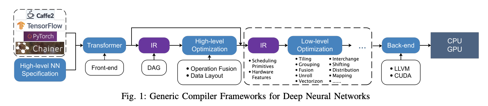

# Deep Learning Compiler Overview

## Why Deep Learning Compilers Matter

Early deep learning deployment relied more on a **framework runtime + hand-tuned high-performance operator libraries** than on a compiler. A framework would allocate tensors in graph order and then invoke implementations such as Conv, BN, or GEMM one by one.

That model became harder to scale over time:

- **Problem 1: operator growth.** New operators kept appearing, and every hardware target needed its own implementation, optimization, and testing effort.
- **Problem 2: hardware diversity.** On CPUs and GPUs, we can often depend on BLAS, cuDNN, or oneDNN. On NPUs and ASICs, however, the ISA, memory hierarchy, data movement rules, and toolchain are very different. Older libraries are difficult to port directly and often cannot reach peak performance.

This is why **deep learning compilers** became important. They perform graph optimization, operator fusion, automatic code generation, and hardware mapping. The goal is to reduce dependence on manual kernel tuning while improving portability and performance.

---

## What a Runtime Actually Is

A runtime is **not** a container. It is the software layer that **executes a model**: it follows dependency order, manages tensor memory, decides which kernel to call, chooses which device to run on, and handles synchronization.

### Eager mode

In eager mode, when you write:

```python
y = conv(x)
```

PyTorch immediately uses its dispatcher to find the matching backend implementation, then calls a CPU kernel, CUDA kernel, cuDNN routine, and so on.

### Graph mode / compile mode

In graph or compile modes—such as `torch.compile`, TorchScript, or export to ONNX Runtime / TensorRT—multiple operators are first turned into a graph. The runtime and compiler can then perform fusion, memory planning, and kernel selection before execution.

> **Runtime = graph executor + memory manager + kernel dispatcher + device/stream manager**
>
> **Kernel library = the concrete implementation invoked by the runtime**

---

## Framework vs. Runtime vs. Compiler vs. Kernel Library vs. Backend

| Term | One-line definition | Main responsibility | Typical examples |
| --- | --- | --- | --- |
| **Framework** | User-facing deep learning workspace | Model authoring, autograd, training/inference APIs, tensor abstraction | PyTorch, TensorFlow |
| **Runtime** | Model execution engine | Execute graphs/operators by dependency, manage tensor memory, handle streams/sync, dispatch kernels | PyTorch runtime, ONNX Runtime |
| **Compiler** | Graph and code optimizer | Graph rewrite, fusion, layout/shape optimization, lowering, code generation | XLA, TensorRT, TorchInductor, TVM |
| **Kernel library** | High-performance operator implementation library | Actually implements Conv, GEMM, Attention, BN, and similar operators | cuDNN, cuBLAS, oneDNN |
| **Backend** | Hardware-facing adaptation layer | Connect the framework/compiler/runtime stack to a specific device and execution path | CUDA backend, XLA GPU backend, MPS backend |

A useful mental model is:

- You **write the model** in the **framework**.
- You **rewrite the graph / fuse ops / generate faster code** in the **compiler**.
- You **schedule execution / allocate memory / launch work** in the **runtime**.
- You **connect the stack to a concrete hardware target** through the **backend**.
- You **perform the actual math** in the **kernel library**.

```text
PyTorch (framework)
  └─ eager or graph execution goes to the runtime
       └─ optionally passes through a compiler (torch.compile / Inductor / TensorRT)
            └─ backend selects the device path: NVIDIA GPU / CPU / MPS / XLA
                 └─ cuDNN / cuBLAS / custom kernels perform the actual math
```

---

## Generic Architecture of a Deep Learning Compiler



*Figure: A generic front-end → IR → optimization → back-end pipeline for deep neural networks.*

A common compiler structure looks like this:

- the **front-end** takes a high-level neural network description
- the stack converts it into one or more **IRs (intermediate representations)**
- the compiler applies **high-level** and **low-level** optimizations
- the **back-end** lowers the result to a concrete hardware target such as CPU or GPU

The front-end and back-end are connected by IR. In practice, many systems use **multiple IR levels**, with a rough split between:

- **High-level IR (HLO)** for graph-level optimization, operation fusion, and data-layout decisions
- **Low-level IR (LLO)** for scheduling, tiling, unrolling, hardware mapping, and low-level code generation

---

## Low-Level Optimization Concepts

| Concept | Study-note explanation |
| --- | --- |
| **Tiling** | Split a large problem into tiles that fit cache, shared memory, or registers. Tiling is also how work gets mapped onto blocks, warps, threads, or cores. For reductions, it can mean computing partial sums first and merging them later. Tile size also affects register/shared-memory use and therefore occupancy. |
| **Grouping** | Broader than vectorization. It means packaging work units into groups that the hardware likes: channels, lanes, warps, instructions, or loop axes. The goal is usually better locality, better balance, cleaner SIMD/SIMT mapping, or easier later vectorization. |
| **Vectorization** | Make one instruction or one load/store operate on multiple elements. On CPUs this is SIMD. On GPUs this often appears as `float2` / `float4` wide load-store patterns. Whether vectorization is possible depends on alignment and layout, and it often appears naturally after grouping. |
| **Fusion** | At low level, fusion is not just “merge graph operators.” After lowering, it can mean loop fusion, kernel fusion, or epilogue fusion. The goal is to reduce intermediate results, global-memory round trips, and kernel-launch overhead while improving locality. |
| **Unrolling** | Loop unrolling does more than remove `i++ / compare / branch` overhead. More importantly, it can increase ILP (instruction-level parallelism), help the scheduler hide latency, and keep accumulators and intermediates in registers longer. The cost is higher register pressure and larger code size; on GPUs it can also reduce occupancy. |

### Tiling at a Glance

Tiling can be understood from three angles:

1. **Output-space tiling**: tile the output space and map tiles onto threads, warps, blocks, or cores.
2. **Reduction tiling**: split a reduction dimension into chunks, compute partial sums, then merge them.
3. **Resource-aware tiling**: choose tile sizes that fit registers, shared memory, or cache and still leave enough occupancy.

### Why Loop Unrolling Helps

Consider a simple dot-product-style loop:

```cpp
float s = 0;
for (int i = 0; i < 8; ++i) {
  s += x[i] * y[i];
}
```

In the original loop, each iteration does two different jobs:

1. **Useful computation**
   - load `x[i]`
   - load `y[i]`
   - multiply
   - add into `s`
2. **Loop control**
   - `i++`
   - compare
   - branch

There is also a key structural issue: every iteration updates the same accumulator `s`, so the loop forms one long dependency chain:

```text
s -> s + x0*y0 -> s + x1*y1 -> s + x2*y2 -> ...
```

Now unroll by 4:

```cpp
float s0 = 0, s1 = 0, s2 = 0, s3 = 0;
for (int i = 0; i < 8; i += 4) {
  s0 += x[i] * y[i];
  s1 += x[i + 1] * y[i + 1];
  s2 += x[i + 2] * y[i + 2];
  s3 += x[i + 3] * y[i + 3];
}
float s = s0 + s1 + s2 + s3;
```

This helps in several ways:

1. **Less loop overhead**  
   The loop-control instructions are amortized across more useful work.

2. **One long dependency chain becomes several shorter ones**  
   Instead of a single accumulator `s`, the compiler now sees `s0`, `s1`, `s2`, and `s3` as independent accumulation chains.

3. **The scheduler sees more independent instructions**  
   More loads, multiplies, and adds can be interleaved, which helps hide latency.

4. **Intermediate values stay in registers more easily**  
   Multiple accumulators and nearby intermediate values can remain live in registers for longer, which is especially useful in GEMM, reductions, and stencil-style code.

A good memory hook is:

> **Do not think of unrolling as only “fewer branches.” Think of it as turning one accumulator into several accumulators, and one dependency chain into several independent chains.**

---

## High-Level IR and Data Layout

At the high-level IR stage, one of the most important questions is **data layout**: how a tensor is arranged in physical memory.

```cpp
addr = base + i0 * stride0 + i1 * stride1 + ...
```

- **Shape** tells you how large each dimension is.
- **Stride** tells you how far the address moves when one index in that dimension increases by 1.
- **Layout** is fundamentally the combination of **dimension order + stride + alignment / packing / blocking**.

### Row-major and Column-major

```cpp
// row-major
offset(i, j) = i * N + j
stride = [N, 1]

// column-major
offset(i, j) = j * M + i
stride = [1, M]

// transpose view of a row-major matrix A[M, N]
shape  = [N, M]
stride = [1, N]
```

### Alignment

Alignment affects several things:

- **Whether memory transactions get split**  
  GPU global memory often prefers 16B / 32B / 64B / 128B alignment so warp accesses can be coalesced into fewer transactions.

- **Whether vectorized load/store is natural**  
  Examples include AVX / AVX-512 on CPUs and `float2` / `float4` or `ldmatrix`-style wide access on GPUs.

- **Shared-memory bank access, Tensor Core fragments, and DMA patterns**  
  Alignment influences bank conflicts, fragment loading, and burst-transfer efficiency.

### Blocked Layout and Packed Layout

- **Blocked layout** splits one dimension into an outer block plus an inner block.
- **Packed layout** reorganizes data into a compact format specialized for a certain kernel or library.

A classic blocked-layout example is `NCHW16c`, which splits the `C` dimension:

```cpp
C = Co * 16 + ci
layout = [N, Co, H, W, ci]
```

This is useful because many hardware targets prefer processing fixed channel groups such as 8, 16, or 32 at a time:

- CPU SIMD often likes widths such as 8 or 16 fp32 lanes.
- GPUs and Tensor Cores often prefer fixed tile shapes.
- NPUs and DMA engines also frequently move data in fixed channel groups.

### Interleaved Layout

```text
RRRR... GGGG... BBBB...   // planar
RGBRGBRGBRGB...          // interleaved
```

Why interleave data?

Because some kernels naturally consume multiple values **together**:

- real and imaginary parts of complex numbers
- multiple image channels at the same pixel
- some dot-product, Tensor Core, or DMA access patterns

So the usual goal of interleaving is:

- one transaction fetches data that will be used together
- fewer gather/scatter style accesses
- a memory layout that matches the hardware access pattern more closely

A simple distinction is:

- **Gather**: read from non-contiguous memory locations into a contiguous register/vector view
- **Scatter**: write register values back to non-contiguous memory locations; on parallel hardware this may require atomics or careful scheduling to avoid write conflicts

---

## How HLO Chooses Layout Across a DAG

At a high level, **HLO chooses the coarse layout direction**, while **LLO chooses the pack/block/interleave details**.

HLO is usually responsible for:

- choosing the dominant layout
- choosing dimension order
- deciding whether layout should be propagated through a chain of operators

A common layout-optimization strategy is:

1. **Choose anchor operators**  
   These are usually operations with strong layout preferences, such as convolutions, GEMMs, or I/O boundaries.

2. **Propagate layout along the DAG**  
   Let nearby operators inherit or adapt to the anchor layout whenever that reduces cost.

3. **Minimize layout conversions**  
   Avoid unnecessary transposes or format conversions between adjacent operators.

---

## Common Layout Preferences by Operation Type

| Scenario / technique | Common preferred layout | Why |
| --- | --- | --- |
| **GPU Conv + Tensor Cores** | **NHWC / channels-last** | The channel dimension is easier to vectorize and easier to feed into Tensor Cores; many libraries are optimized for channels-last |
| **CPU Conv + SIMD** | **NCHWc / blocked channels** such as `NCHW8c` or `NCHW16c` | Channel blocks align with SIMD width, keep the inner dimension contiguous, and make vector loads/FMA efficient |
| **GEMM** | Make **K-dimension access smooth**; often use **packed A/B panels** | The inner loop consumes K continuously, so microkernels want contiguous data and high cache reuse |
| **Elementwise chains** | **Inherit the main producer layout** | Avoid meaningless transposes and make fusion easier |
| **Input/output zero-copy boundaries** | Preserve the external native layout | Avoid an extra format conversion |
| **NPU / DMA / specialized accelerators** | Often **blocked / tiled / interleaved** hardware-native layouts | Match on-chip buffers, burst transfers, systolic-array organization, or DMA units |
| **A fusable operator chain** | Propagate a common layout when possible | Reduce intermediate materialization and layout conversion |
| **Channel count divisible by 8 / 16 / 32** | Prefer `C8` / `C16` / `C32` blocked layouts | Better match vector width or fixed hardware tiles |
| **A very hot trailing dimension** | Make that dimension the innermost contiguous dimension | Improve load/store continuity, cache behavior, or memory coalescing |

---

## Intuition: Three Common Cases

### GPU Convolution + Tensor Cores: Why NHWC Often Wins

Many convolution implementations eventually reduce to something close to **im2col** or **implicit GEMM**, and Tensor Cores want matrix-like tiles such as:

```text
D = A * B + C
```

A useful intuition is to imagine a simple `1x1` convolution. For each pixel, the kernel consumes all channel values together.

- In **NCHW (planar)**, the channels for one pixel are separated by large strides in memory.
- In **NHWC (channels-last / interleaved by channel)**, the channels for one pixel sit much closer together in memory.

That makes it easier to load channel data together, helps vectorized access, and fits many Tensor Core-friendly library implementations.

### CPU Convolution + SIMD: Why `NCHWc` Exists

The core problem with plain `NCHW` on CPUs is:

- for one spatial position, neighboring channels are often separated by a stride of `H × W`
- that means SIMD cannot issue clean contiguous loads across channels
- the result is more scalar or gather-like behavior, poor bandwidth use, and underutilized vector units

So CPU kernels often use **channel blocking**:

```text
[N, C_outer, H, W, C_inner]
```

This makes the channel dimension physically contiguous inside the inner block.

Examples:

- AVX2: 256-bit = 8 × fp32
- AVX-512: 512-bit = 16 × fp32

Once channels are blocked to match SIMD width, vector loads and FMAs become much more natural.

A useful contrast is:

- **GPU** execution can often tolerate more irregularity because warps and memory coalescing rules are different.
- **CPU SIMD** is more rigid, so blocked layouts matter more.

### GEMM: Why Packed Panels Matter

The inner loop of GEMM consumes data along the **K dimension**. A microkernel wants that access pattern to be as contiguous as possible.

Why pack `B`?

- In a row-major matrix, reading `B` by columns often becomes a **strided access pattern**.
- That means a cache line may be fetched even though only a small fraction of it is used immediately.
- At large matrix sizes, useful data gets evicted before the next reuse.

So packing means:

- pre-reorder `B` into the order the microkernel will consume
- turn future strided reads into near-contiguous `ptr++` style reads
- spend one extra copy up front to get much higher cache hit rate and better SIMD efficiency during the main compute phase

A compact summary is:

> **Packing B means rearranging data once so the microkernel does not have to pay for strided reads during the main GEMM loop.**

---

## Front-End Optimizations

Common front-end or graph-level optimizations include:

- **Zero-dimensional / empty-tensor elimination**: remove meaningless operators related to empty tensors
- **NOP elimination**: remove nodes that do not change semantics
- **Algebraic simplification**: rewrite the graph into an equivalent but cheaper form
  - merge consecutive transposes
  - remove identity transposes
  - turn some “transpose without real data movement” cases into reshapes
  - rewrite some `ReduceMean` patterns into `AvgPool`
- **Common subexpression elimination (CSE)**: compute identical subgraphs only once

```cpp
t1 = matmul(x, w)
t2 = matmul(x, w)

// after CSE
t = matmul(x, w)
t1 = t
t2 = t
```

- **Dead code elimination (DCE)**: remove nodes whose outputs are never used

---

## Back-End Optimizations

Common back-end or target-specific optimizations include:

- **Hardware-specific optimization**  
  The back-end specializes generated code for a concrete architecture in order to reach high performance.

- **Auto-tuning**  
  Systems such as TVM search for good schedule parameters automatically.

- **Optimized kernel-library calls**  
  Instead of generating everything from scratch, the back-end may call highly tuned vendor libraries where that is the best choice.

---

## A Useful Final Mental Model

A practical summary is:

- **Framework**: where the model is written
- **Compiler**: where the graph is rewritten and lowered
- **Runtime**: where execution is scheduled and memory is managed
- **Backend**: where the system is connected to a specific hardware target
- **Kernel library**: where the actual numeric computation happens

That division of labor is the core reason deep learning compilers matter: they sit between model semantics and hardware reality.
