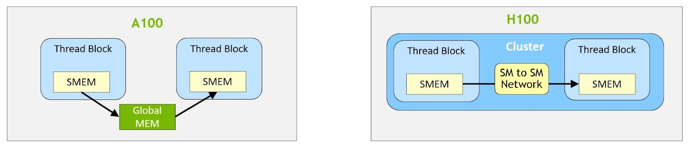
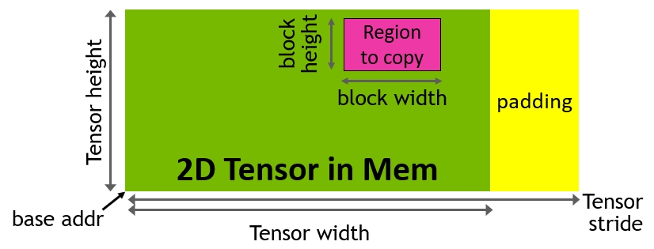
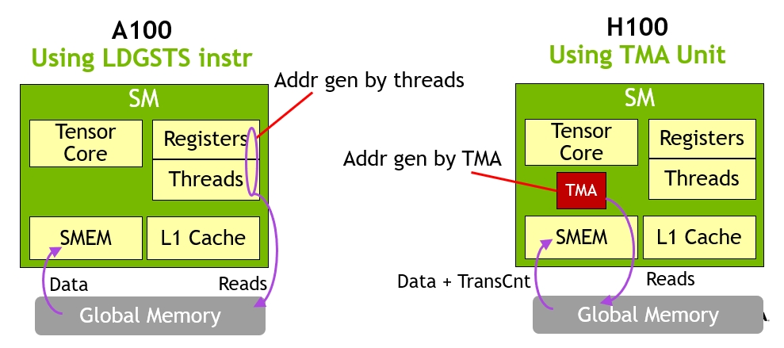
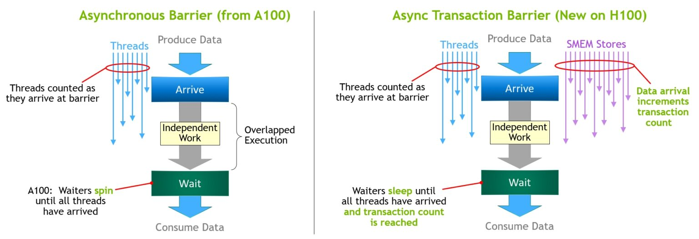
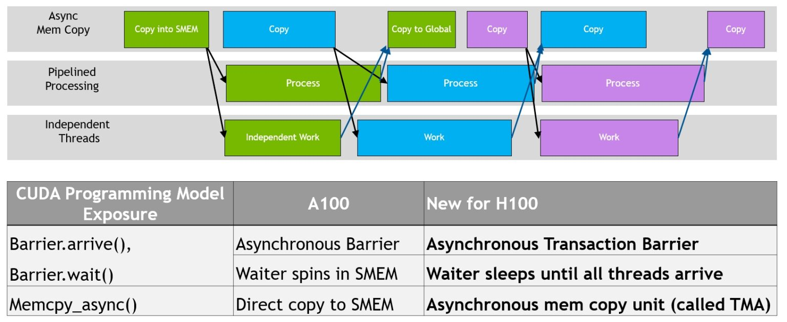

# Hopper Features

## 1. Hopper thread block clusters

Hopper adds an optional hierarchy level between the grid and the block: the **thread block cluster**.

### What changes with clusters


- Blocks in the same cluster are guaranteed to run concurrently on SMs within the same **GPC(GPU Processing Cluster)**.
- Blocks in a cluster can read, write, and perform atomics on one another’s shared memory.
- NVIDIA refers to this cluster-visible shared memory space as **Distributed Shared Memory (DSMEM)**.
- Cross-block synchronization inside a cluster is available through `cooperative_groups::cluster_group` and `cluster.sync()`.
- Intra-cluster (Inside): Co-scheduled & Simultaneous.
- Inter-cluster (Between): Randomly scheduled & Independent.

### Why this matters

Clusters extend the working set and communication scope beyond a single block. That creates a useful middle ground between:

- **local shared memory**, which is fast but limited to one block, and
- **global memory**, which is flexible but much slower for repeated fine-grained communication.

For some kernels, DSMEM lets you keep intermediate communication on chip instead of round-tripping through global memory.

### Practical notes

- `__cluster_dims__(x, y, z)` sets cluster dimensions at compile time.
- Cluster dimensions can also be configured at runtime with `cudaLaunchKernelEx`.
- The grid is still expressed in **blocks**, so the total number of launched blocks should be a multiple of the cluster size.
- The **portable** maximum cluster size is **8 blocks**. Hopper H100 can opt into a **nonportable** cluster size of 16.

### Minimal CUDA example

```cpp
#include <cooperative_groups.h>
namespace cg = cooperative_groups;

__global__ void __cluster_dims__(2, 1, 1) cluster_demo(int* out) {
    __shared__ int smem;

    cg::cluster_group cluster = cg::this_cluster();
    int block_rank = cluster.block_rank();

    if (threadIdx.x == 0 && block_rank == 0) {
        smem = 99;
    }

    // Ensure block 0 has written before block 1 reads.
    cluster.sync();

    if (threadIdx.x == 0 && block_rank == 1) {
        int* peer = cluster.map_shared_rank(&smem, 0);
        out[0] = *peer;
    }

    // Ensure remote DSMEM access finishes before either block exits.
    cluster.sync();
}
```

## 2. Distributed Shared Memory



- Distributed shared memory (DSMEM) essentially extends the shared memory of multiple blocks within the same thread block cluster into a space that can be accessed across SMs with direct load/store/atomic operations.
- Its main value is enabling blocks inside a cluster to share and exchange data much more efficiently, without always falling back to a farther memory level like global memory.

## 3. Tensor Memory Accelerator (TMA)

Hopper introduces the **Tensor Memory Accelerator (TMA)** for bulk asynchronous copies.


### What TMA changes

Compared with older global-to-shared copy flows, TMA moves more of the work into dedicated hardware:

- a thread issues a **descriptor-based** copy,
- the descriptor carries tensor shape, strides, and block coordinates,
- address generation and bulk data movement are handled by hardware,
- synchronization is tied to **barriers** that track both thread arrival and transfer completion.

This reduces per-element address-generation overhead and makes it easier to overlap data movement with computation.

### Supported directions and cluster behavior

On Hopper-class GPUs, TMA supports bulk copies such as:

- **global → shared::cta**
- **global → shared::cluster**
- **shared::cta → global**
- **shared::cta → shared::cluster**

Within a cluster, TMA also supports **multicast**, where one global-memory read can populate the shared memory of multiple blocks. In CUDA’s documentation, this multicast path is specifically optimized for **`sm_90a`**.

## 4. Asynchronous Transaction Barrier



**Idea:** synchronize on both thread arrival and data arrival, meaning the data has actually been written to **SMEM** or **DSMEM**.



- **Ampere async barrier:** counts only thread arrivals; waiters typically spin.
- **Hopper improvement 1:** waiters can sleep instead of active polling.
- **Hopper improvement 2:** the asynchronous transaction barrier also tracks transaction or byte-count completion.

**Use cases**

- **With TMA:** ensures asynchronous copies are complete and data has landed before consumption.
- **With cluster / DSMEM:** enables safe block-to-block data exchange within a cluster.
- **Typical patterns:** producer-consumer, double buffering, load/compute overlap, and pipelined tiling.

**Asynchronous execution**


## 5. ToDos

1. WGMMA + 4th-gen Tensor Core
2. FP8
3. DPX
4. Transformer Engine
5. 4th-gen NVLink / NVSwitch
6. New NVLink Switch System

[NVIDIA Hopper Architecture In-Depth](https://developer.nvidia.com/blog/nvidia-hopper-architecture-in-depth/)
