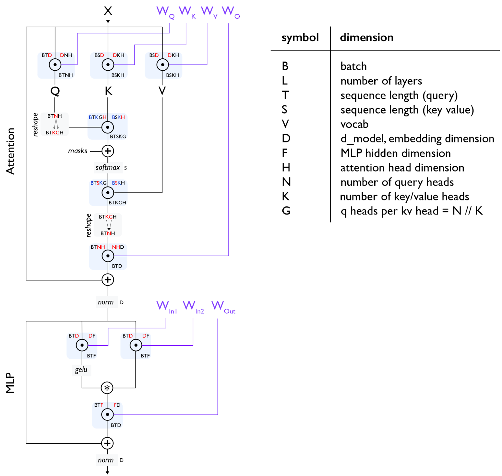
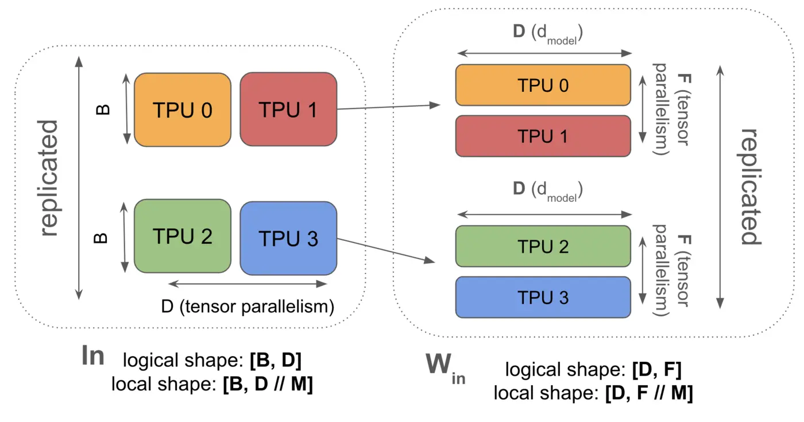
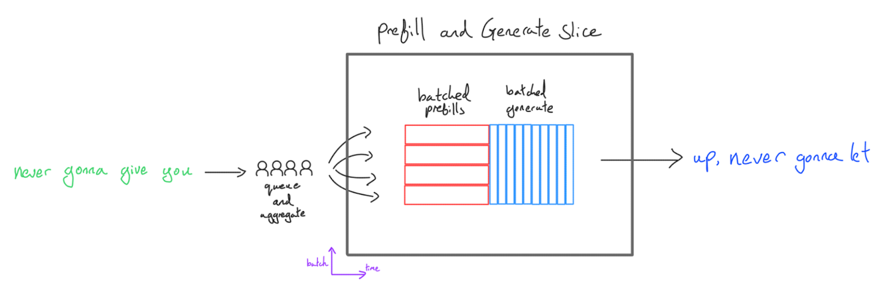
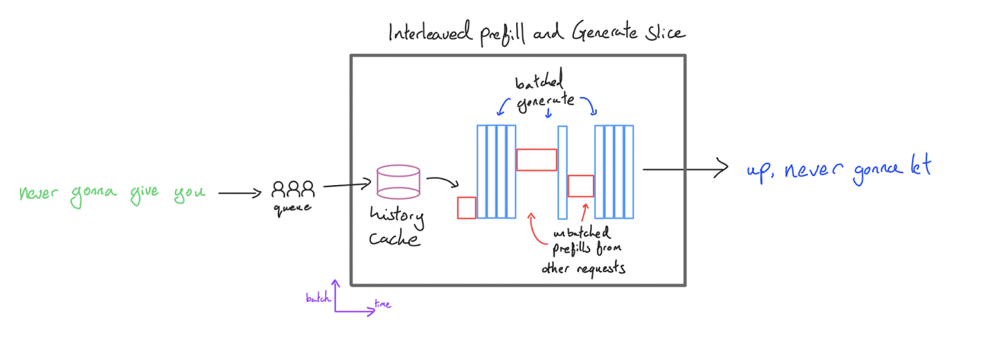
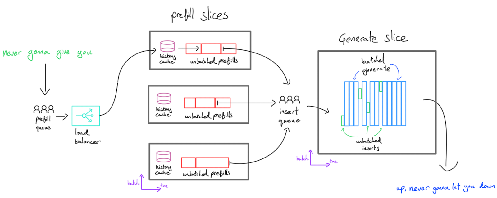

# Inference Systems Notes

This note integrates the exported `Inference` page into the repo's inference-systems documentation. It preserves the original technical intent while cleaning up grammar, tightening terminology, and organizing the discussion around three themes:

1. **transformer computation during inference**
2. **hardware and parallelism constraints**
3. **serving-system design patterns**

The discussion assumes a **decoder-only transformer**.

---

## Core framing: prefill vs. generation

Inference is easiest to understand if we separate it into two stages:

- **Prefill**: run the full prompt through the model once and build the KV cache.
- **Generation / decode**: generate one new token at a time using the accumulated KV cache.

For causal self-attention:

- during **prefill**, the query length `T` and key/value length `S` are both the prompt length
- during **generation**, the current query length is `T = 1`, while `S` is the cached history length

This separation works because future tokens do not change the representations of past tokens. Once a past token's `K` and `V` have been computed at a given layer, they can be reused safely.

---

## Transformer dimensions and tensor shapes

The figure above summarizes the main tensor dimensions used in the notes.

### Symbol legend

- `B` — batch size
- `L` — number of layers
- `T` — query sequence length
- `S` — key/value sequence length
- `V` — vocabulary size
- `D` — model dimension (`d_model`)
- `F` — MLP hidden dimension
- `H` — attention head dimension
- `N` — number of query heads
- `K` — number of key/value heads
- `G` — number of query heads per KV head, where `G = N // K`

### A 70B-style example

The source uses a Llama-style 70B example with the following constants:

- `D = 8192`
- `N = 64`
- `K = 8`
- `H = 128`, where `D / N = 128`
- `G = 8`, where `N / K = 8`
- `F = 28672`
- `V = 128256`
- `L = 80`

### Fixed weight shapes

These weight shapes are the same in both prefill and generation:

- `W_Q: [D, N * H] = [8192, 8192]`
- `W_K: [D, K * H] = [8192, 1024]`
- `W_V: [D, K * H] = [8192, 1024]`
- `W_O: [N * H, D] = [8192, 8192]`
- `W_In1: [D, F] = [8192, 28672]`
- `W_In2: [D, F] = [8192, 28672]`
- `W_Out: [F, D] = [28672, 8192]`

### Prefill-stage activations

For a prompt length of 2048:

- input `X [B, T, D] = [B, 2048, 8192]`
- projected `Q [B, T, N, H] = [B, 2048, 64, 128]`
- projected `K, V [B, S, K, H] = [B, 2048, 8, 128]`
- GQA reshape `Q [B, T, K, G, H] = [B, 2048, 8, 8, 128]`
- attention scores `QK^T [B, T, S, K, G] = [B, 2048, 2048, 8, 8]`
- attention output before merge `[B, 2048, 8, 8, 128]`
- merged attention output `[B, 2048, 64, 128]`
- output projection `[B, 2048, 8192]`

For the MLP:

- input `[B, 2048, 8192]`
- gate and up projections: both `[B, 2048, 28672]`
- activated and multiplied intermediate `[B, 2048, 28672]`
- down projection `[B, 2048, 8192]`

A practical note from the source: these large score tensors are often shown conceptually, but high-performance kernels such as FlashAttention do **not** fully materialize the full score matrix in HBM.

### Generation-stage activations

If the cache already contains 2048 historical tokens and the model is generating token 2049:

- current input `X [B, 1, 8192]`
- projected `Q [B, 1, 64, 128]`
- cached and concatenated `K, V [B, 2048, 8, 128]`
- reshaped `Q [B, 1, 8, 8, 128]`
- attention scores `[B, 1, 2048, 8, 8]`
- attention output before merge `[B, 1, 8, 8, 128]`
- merged output `[B, 1, 64, 128]`
- final output projection `[B, 1, 8192]`

For the MLP during generation:

- input `[B, 1, 8192]`
- gate and up projections: both `[B, 1, 28672]`
- activated intermediate `[B, 1, 28672]`
- down projection `[B, 1, 8192]`

The main systems implication is simple: generation computes only one new token at a time, but it must repeatedly read a large KV cache. That is one reason decode is often **memory-bandwidth-bound**.

---

## Why KV cache helps

### Naive decoding

Without KV cache, generating token `i` recomputes the full forward pass over all previous tokens plus the new one.

Using the source's reasoning:

- FFN work accumulates like `1 + 2 + ... + n = O(n^2)`
- attention work accumulates like `1^2 + 2^2 + ... + n^2 = O(n^3)`

### KV-cached decoding

With KV cache:

- prefill computes the prompt once and stores `K` and `V` for every layer
- each decode step computes only the new token's projections and MLP work
- historical `K` and `V` are read from cache instead of recomputed

Then:

- FFN work becomes `O(n)`
- attention work becomes `1 + 2 + ... + n = O(n^2)`

### Common clarifications

#### Why cache `K` and `V`, but not `Q`?

`Q` is only needed for the current token and is discarded immediately after the attention step. `K` and `V` are the persistent memory that all future tokens must attend to.

#### Is the cache stored only for the first layer?

No. Every transformer layer has its own attention computation, so every layer needs its own historical `K` and `V` cache.

#### Why not cache hidden states instead?

Because future attention consumes `K` and `V` directly. If we stored only hidden states, each decode step would still need to recompute historical `K` and `V` using `W_K` and `W_V`.

#### Why talk about logits separately?

Logits are the immediate inputs to sampling decisions such as temperature scaling, top-k, top-p, or beam search. They are short-lived outputs, not persistent state like the KV cache.

---

## Transformer bottlenecks during inference

The notes frame inference around two operator families: **dense linear layers** and **attention**.

### 1. Linear operations

This includes:

- Q/K/V/O projections
- MLP matrix multiplications
- other dense projection layers

A simplified model for one dense layer is:

- matrix multiplication `BD * DF = BF`
- FLOPs are approximately `2BDF`
- BF16 memory traffic is approximately `2BD + 2DF + 2BF`

This leads to a useful rule of thumb:

- during **prefill**, the sequence length `T` can already provide enough work for dense layers to become compute-bound
- during **generation**, dense projections often need batching to reach high hardware utilization

A threshold such as `B >= 240` should be treated only as a rough rule of thumb for some dense decode workloads on some hardware. It is **not** a universal law.

### 2. Attention operations

For multi-head attention, the simplified traffic model is:

- read `Q` with shape `[B, T, D]`
- read cached `K/V` with shape `[B, S, D]`
- compute `QK^T` and `AV`
- write output `[B, T, D]`

The source gives a simplified arithmetic-intensity model:

$$
\text{MAAI} = \frac{ST}{S + T}
$$

Main implications:

- **prefill**: when `S = T`, arithmetic intensity grows roughly like `T / 2`, so attention can become compute-bound for long enough sequences
- **generation**: when `T = 1`, arithmetic intensity stays close to `1`, so decode attention is typically memory-bandwidth-bound

---

## Decode latency and throughput models

The source gives the following rule-of-thumb formula for **general decode step time**:

$$
\text{Theoretical Step Time (General)} =
\frac{\text{Batch Size} \times \text{KV Cache Size}}{\text{Total Memory Bandwidth}}
+
\max \left(
\frac{2 \times \text{Batch Size} \times \text{Parameter Count}}{\text{Total FLOPs/s}},
\frac{\text{Parameter Size}}{\text{Total Memory Bandwidth}}
\right)
$$

Interpretation:

- the first term is the bandwidth cost of reading the KV cache during attention
- the second term captures dense-layer cost, which may be either **compute-bound** or **bandwidth-bound** depending on hardware and batch size

So, in small-batch generation:

- attention is usually bandwidth-bound
- the linear/MLP part may be compute-bound or bandwidth-bound
- smaller batch gives lower latency but poorer utilization
- larger batch improves utilization, but it can also increase per-step latency

A related bandwidth-oriented throughput heuristic is:

$$
\text{Theoretical Max Tokens/s} =
\frac{\text{Batch Size} \times \text{Total Memory Bandwidth}}
{\text{Batch Size} \times \text{KV Cache Size} + \text{Parameter Size}}
$$

This should be treated as a study heuristic rather than a precise production-performance prediction.

---

## Optimization ideas for throughput and latency

### GQA

Grouped-query attention reduces the number of KV heads so that multiple query heads share the same KV heads. Compared with full multi-head attention, this reduces KV-cache size in proportion to the query-to-KV head ratio.

### Local attention

If some layers use local attention instead of full global attention, the effective KV-cache length for those layers is capped by a smaller context window. In long-context settings, this can materially reduce total KV-cache size.

### Sharing KV across layers

Cross-layer KV sharing can reduce total KV-cache storage. However, it does **not** automatically improve step time, because the shared cache may still need to be read multiple times from HBM.

### Quantization

Inference is often less sensitive than training to reduced precision for weights and KV cache. Quantizing weights and KV cache to formats such as INT8, INT4, or FP8 can:

- reduce memory-bandwidth demand
- lower the batch size required to approach the compute roofline
- free memory for larger batches or more active requests

### Ragged HBM and paged attention

Paged attention avoids large amounts of global padding in KV-cache allocation. It is a runtime-system optimization rather than a model-architecture change. The main benefit is better memory utilization; the cost is greater implementation complexity and less regular access behavior.

---

## Distributing inference across devices

### Tensor-parallel sharding example

This figure shows a simple tensor-parallel layout across four TPUs.

For the activation `In`:

- logical shape: `[B, D]`
- local shape on each shard: `[B, D // M]`

For the MLP weight `W_in`:

- logical shape: `[D, F]`
- local shape on each shard: `[D, F // M]`

The key point is:

- the **batch dimension** is replicated
- the **model dimensions** (`D` or `F`) are partitioned with tensor parallelism

This is a good mental model for why prefill and decode can prefer different sharding strategies: they have different bottlenecks, even though they run the same model.

### Prefill scaling strategy

The notes suggest the following order:

1. start with **tensor parallelism / model parallelism** to distribute the model and large matrix multiplications
2. increase TP until interconnect communication becomes the bottleneck
3. if more devices are available and the sequence is still long, extend further with **sequence parallelism**

Why TP is attractive during prefill:

- the model may not fit on a single device
- long-sequence prefill contains large, high-intensity GEMMs that benefit from more aggregate FLOPs

### Generation scaling strategy

Generation is harder to optimize because:

- it is harder to gather large batches of live requests
- latency targets are stricter
- the stage is more memory-bound and more communication-sensitive

The source's practical principles are:

- move activations when necessary, but avoid moving full KV cache or full parameters unnecessarily
- with larger batches, increase model parallelism until the system hits a FLOPs-versus-interconnect limit
- with smaller batches, stronger sharding can reduce latency, even if throughput drops slightly
- if model-parallel sharding exceeds the number of KV heads, KV cache may also need to be partitioned along the batch dimension

---

## Inference-engine design patterns

One of the most useful parts of the exported notes is the comparison of several serving layouts.

### 1. Monolithic batching: prefill together, then generate together

In this layout, a batch is prefetched together and then decoded together on the same slice.

Advantages:

- conceptually simple

Disadvantages:

- time-to-first-token (TTFT) can become poor when prefill batches are large
- short requests can be delayed by long requests during generation
- prefill suffers from padding to the longest prompt in the batch
- prefill and generation are forced to share the same sharding strategy, even though their optimal layouts may differ

### 2. Interleaved prefill and decode on the same slice

In this design:

- decode requests remain batched
- prefill can run with `B = 1` or in smaller chunks
- prefill and decode are interleaved by the scheduler
- the history cache keeps per-request state alive while new work is inserted into the decode stream

Benefits:

- better TTFT because prefill no longer waits for one large shared batch
- decode can still preserve reasonable throughput

Trade-offs:

- a large prefill can still stall decode traffic unless prefill is chunked
- inter-token latency may become less smooth
- TTFT improves, but streaming smoothness can worsen

### 3. Disaggregated prefill and decode

This figure shows a more modern large-scale serving layout:

- requests enter a **prefill queue**
- a **load balancer** routes work across several prefill slices
- each prefill slice builds or extends the request's **history cache**
- completed inserts are handed off through an **insert queue**
- a separate **generate slice** runs the batched decode path

Benefits:

- lower latency at scale because prefill and decode do not contend as directly
- independent scaling of prefill capacity and decode capacity
- better hardware specialization, because prefill and decode can use different sharding strategies or even different machine pools

This matches the source's recurring point:

- **prefill is more compute-oriented**
- **decode is more memory- and latency-oriented**

---

## Continuous batching, chunked prefill, and mixed workloads

A common implementation question is whether prefill and decode should run together.

The answer is nuanced:

- for the **same request**, prefill and decode are inherently sequential
- across **different requests**, many real systems interleave prefill and decode on the same accelerators

This is closely related to:

- continuous batching / in-flight batching
- chunked prefill
- dynamic scheduling rather than fixed static partitioning

The important point is that the real problem is **resource contention**, not just stream assignment. Practical schedulers must reason about shared pressure on:

- SMs or compute units
- registers and shared memory
- L2 cache
- HBM bandwidth
- model weights
- the growing KV cache

So the true optimization target is scheduler design, not a simplistic "one stream for prefill, one stream for decode" split.

---

## Conservative notes and open items

A few items from the source are intentionally kept light here:

- some concepts were originally introduced through figures and screenshots rather than long text
- `Prefix Caching` and `JetStream` appear as headings in the source, but they are not developed there
- the linked LLaMA 13B latency/throughput example is referenced as an external example rather than rewritten in full

If needed, those parts can be expanded in a later pass.
