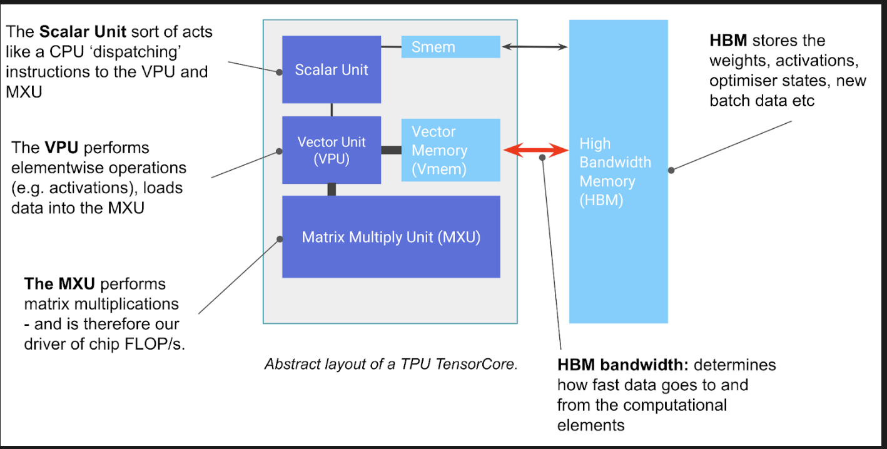
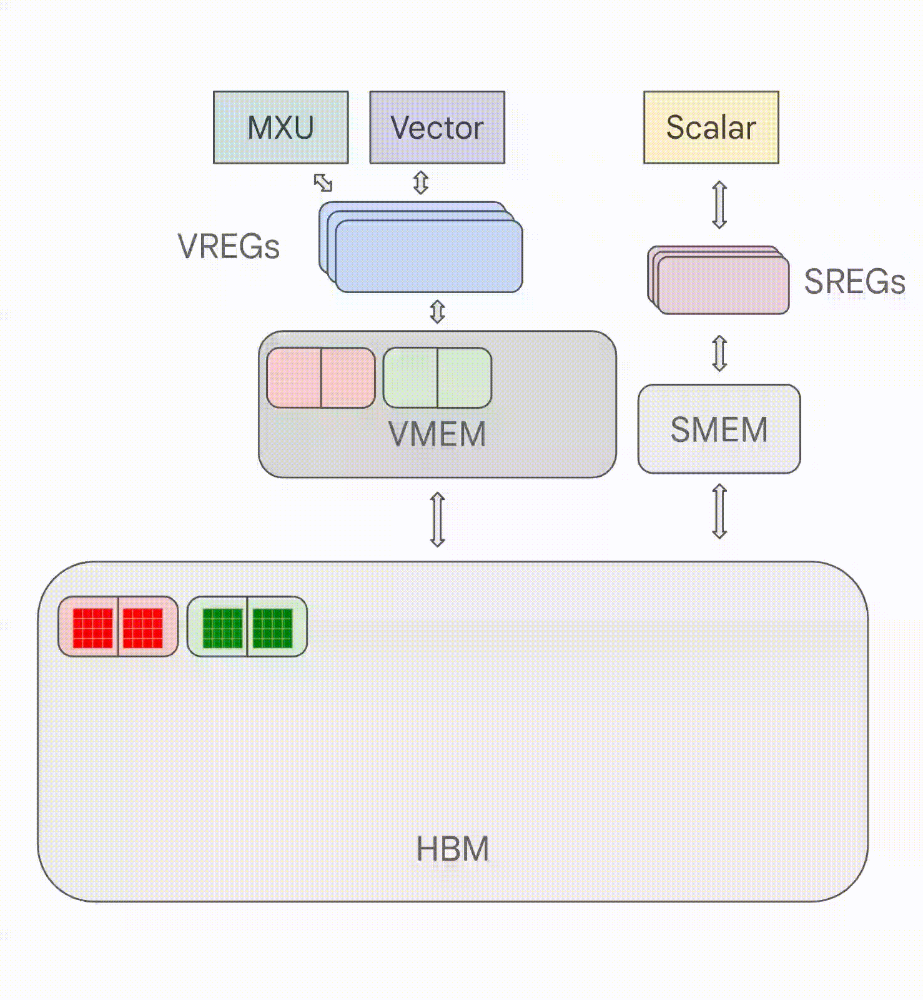

# TPU Architecture Notes

## 1. TPU architecture

At a high level, a TPU is built around a small number of very large matrix engines rather than thousands of small general-purpose cores.

The diagrams on the first two pages of my original notes helped me form the following mental model:

- **MXU (Matrix Multiply Unit)** is the main engine for dense matrix multiplication.
- **Vector Unit / VPU** handles more general-purpose tensor work such as activations, softmax, elementwise add/mul, and reductions.
- **Scalar Unit** acts as the controller: it fetches and dispatches instructions, manages loops, computes address offsets, and kicks off DMA-style data movement.
- **HBM** provides large-capacity memory for weights, activations, and optimizer state.
- **On-chip memories and registers** sit between HBM and compute units so data can be staged close to the hardware that will consume it.

A compact way to think about the data path is:

`HBM <-> on-chip memory <-> registers <-> MXU / Vector Unit`

---

## 2. Compute structure: MXU, vector unit, and scalar unit

### MXU

The MXU is where most of the raw TPU compute comes from.

For pre-v6e TPUs, the matrix engines are organized around **128 x 128 systolic arrays**. The multiplies use **bfloat16** inputs and accumulate into **fp32**. For v6e and later, the MXU size moves to **256 x 256**.

One execution intuition I wanted to preserve from the original note is to think in terms of tiled matmuls such as:

`bf16[8,128] @ bf16[128,128] -> f32[8,128]`

I treat this as a useful way to reason about tiled execution, not as a universal cycle-by-cycle rule for every TPU generation.

### Important correction

One TPU **core / TensorCore is not the same thing as one MXU**.

A TensorCore contains **multiple MXUs**, plus a vector unit and a scalar unit. That distinction matters:

- **TPU v4:** 2 TensorCores per chip, 4 MXUs per TensorCore
- **TPU v5e:** 1 TensorCore per chip, 4 MXUs per TensorCore

So the right mental model is:

**TensorCore = multiple MXUs + Vector Unit + Scalar Unit**

### Vector unit / VPU

The vector unit handles operations that are not pure large matmuls, such as:

- ReLU and other activations
- softmax-style work
- vector elementwise add/multiply
- reduction operations

### Scalar unit

The scalar unit is the scheduler/controller side of the chip. It is responsible for:

- instruction fetch / decode / dispatch
- loop control
- address generation
- initiating HBM -> on-chip transfers
- lightweight scalar logic such as branches, boundaries, and some dynamic-shape decisions

This is also where the distinction between **control state** and **tensor math** becomes clear.

---

## 3. Memory hierarchy

### HBM

HBM is the large-capacity memory layer. It stores weights, activations, optimizer state, and batch data. Capacity and bandwidth depend on TPU generation:

- **v3:** 32 GiB HBM, 900 GB/s per chip
- **v4:** unified 32 GiB HBM, 1200 GB/s per chip
- **v5e:** 16 GB HBM, 800 GiB/s per chip

### On-chip memory

My original notes grouped TPU on-chip memory into a simple idea: a much faster scratchpad layer between HBM and the compute units.

That idea is still correct, but the terminology needs to be more precise:

- **VMEM** is a small, fast on-chip SRAM used as a scratchpad close to the compute units.
- On **TPU v4**, each TensorCore has **16 MiB VMEM**, and the two TensorCores also share **128 MiB CMEM**.
- The key performance idea is not the exact label, but that TPUs rely on **explicitly staged on-chip memory** to keep the matrix engines fed.

### SMEM and registers

The second-page diagram also highlights the control-side storage:

- **SMEM** stores scalar control data such as loop counts, addresses, and scheduling-related metadata.
- **SREGs / VREGs** are the registers closest to scalar and vector/matrix execution respectively.

A useful distinction is:

- **SMEM/SREGs** hold control information
- **VMEM/VREGs** support high-throughput tensor data movement and compute

---

## 4. Why VMEM matters: prefetch and overlap

A major performance idea in my original notes is that TPU performance depends heavily on whether data can be staged into fast on-chip memory before it is needed.

If two conditions hold:

1. the next computation does not depend on unresolved data hazards, and
2. the next required tiles are already known,

then the system can **prefetch** future data into on-chip memory while the current compute is still running.

This changes the optimization mindset. Instead of thinking only about raw FLOPs or HBM bandwidth, you try to structure execution so the MXU consumes data from fast on-chip memory as often as possible.

### Transformer / FFN

One concrete example from the notes is overlapping **attention** and the next **FFN** stage:

- while attention is still computing on the current activation tile,
- some of the next FFN weight tiles can already be prefetched into on-chip memory,
- so once the attention output tile is ready, the MXU can start the FFN matmul with less waiting on HBM.

I keep this because it captures the right systems intuition: on TPUs, good performance often comes from **careful overlap of compute and memory movement**, not just bigger models or higher nominal FLOPs.

---

## 5. Chip, core, and system organization

### Cloud TPU exposure

In Cloud TPU, what matters operationally is not just the chip, but how chips are grouped and exposed:

- A **slice** is a set of TPU chips connected by high-speed **ICI** inside the same TPU Pod.
- A **TPU VM** can expose a different number of chips depending on TPU generation and slice size.
- For **v5e**, a host has 8 chips, and TPU VMs can expose 1, 4, or 8 chips depending on the slice configuration.

---

## 6. Networking: ICI, slices, Pods, and DCN

### ICI inside a slice / Pod

**ICI (inter-chip interconnect)** is the specialized high-speed TPU-to-TPU network used inside a slice.

Topology depends on generation:

- **v4** uses direct nearest-neighbor links in **3 dimensions**
- **v5e** returns to a **2D torus** design

For TPUs that are not direct neighbors inside a slice, traffic travels hop by hop through intermediate chips.

### Pods and cubes

A **TPU Pod** is a large group of TPUs connected by this high-speed network.

For v4, the system is physically organized around **4 x 4 x 4 cubes** of chips, and larger slices are built from one or more of these cubes. Certain slice shapes can also use **twisted torus** variants to improve bisection bandwidth.

### DCN across slices

When a workload extends beyond one slice, communication uses the **data center network (DCN)**.

This is a different performance regime:

- ICI is the fast path for tightly coupled TPU communication
- DCN is slower and should be treated as a scarce resource
- large-scale jobs should try to minimize time spent waiting on DCN transfers

That is why distributed training strategy matters so much: poor sharding or communication placement can make a theoretically fast TPU job communication-bound.

---

## 7. Practical performance implications

- TPU structure is relatively simple:
  - HBM ↔ MXU is very fast
  - ICI-connected TPUs are fast
  - DCN (cross-datacenter) is much slower

### Bandwidth

- **HBM bandwidth:** between TensorCore and its attached HBM (~2.8 TB/s)
- **ICI bandwidth:** between a TPU chip and its 4 or 6 nearest neighbors (~90 GB/s)
- **PCIe bandwidth:** between CPU host and TPU tray
- **DCN bandwidth:** between CPU hosts (typically not via ICI) (~6.25 GB/s)
- Within a slice, TPUs are connected via ICI to nearest neighbors  
  → non-adjacent communication requires multi-hop routing

### MXU utilization

- Weight matrices should be padded in both dimensions to at least:
  - **128 (pre-v6e)**
  - **256 (v6e)**

  to fully utilize the MXU

### Precision

- Lower-precision matmul is typically faster
- For supported hardware:
  - **INT8 / INT4 ≈ 2× / 4× bf16 throughput**
- VPU computations still run in **fp32**

### Multi-device training

- A group of TPUs connected via ICI forms a **slice**
- Different slices communicate via **DCN** (e.g., across Pods)

- Since DCN is much slower than ICI:
  → minimize waiting on cross-slice communication

- DCN path is **host-based**:
  TPU → PCIe → host → network → host → PCIe → target TPU HBM

---

## 8. ToDo

- TPU internals
- How systolic array works
