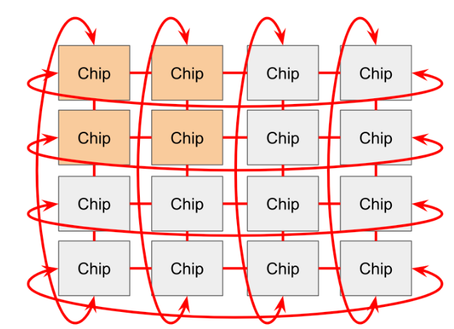
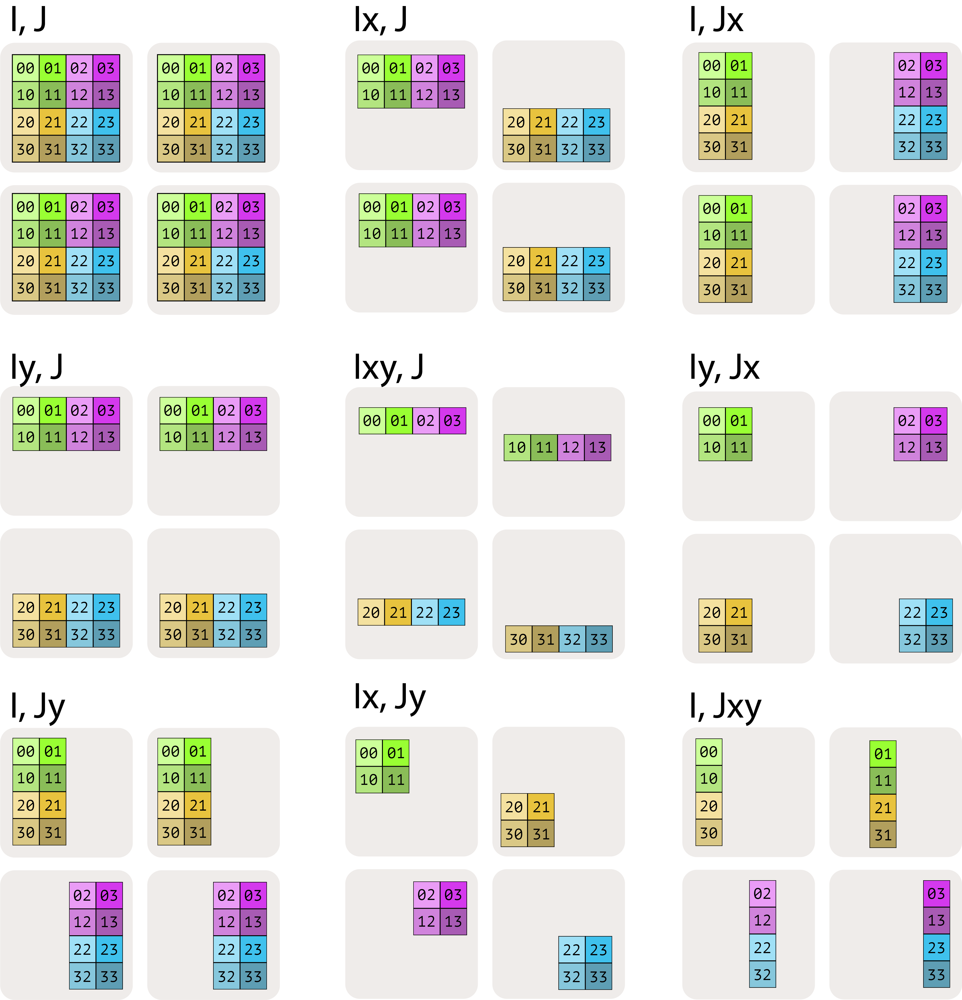
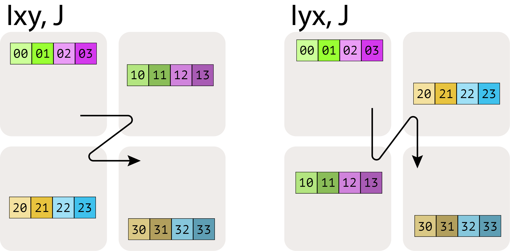

# TPU Systems Notes

## TPU architecture

The source describes a TPU as a system built around compute engines plus a layered memory hierarchy.

Main pieces preserved from the notes:

- **MXU**: the matrix multiplication unit
- **VPU**: handles more general vector and elementwise work such as activations and reductions
- **scalar unit / core**: controls instruction flow, addressing, DMA initiation, and lightweight scalar logic
- **SMEM**: small storage for scalar/control data
- **VMEM**: programmer-managed on-chip scratchpad memory close to compute
- **HBM**: high-bandwidth external memory, much larger but much slower than VMEM

The source repeatedly treats VMEM as a large manually managed cache or scratchpad that is critical for performance.

## Bandwidth hierarchy

The notes stress the gap between on-chip and off-chip bandwidth. One specific source point is that VMEM bandwidth can be far higher than HBM bandwidth, which is why tiling and data reuse matter so much.

The source also includes concrete TPU bandwidth figures, such as HBM, ICI, and DCN examples, to show how quickly distributed performance becomes communication-limited.

## TPU pod networking

The source describes TPU pod interconnect evolution roughly as:

- older systems: 2D torus
- newer systems: 3D torus

It also preserves a few practical distinctions:

- **ICI** connects nearby TPU chips directly without host involvement
- **DCN** connects across hosts and is much slower
- very large systems are built from smaller repeating modules connected through optical wraparound links

The core systems lesson is that communication cost depends strongly on where the communication happens in the hierarchy.

## Practical takeaway from the source

The TPU notes are less about memorizing hardware trivia and more about building intuition for scaling decisions:

- which memory level an operation is using
- whether the bottleneck is math, memory, or network
- whether a given parallel strategy stays on fast local links or spills into slower inter-host communication

## Mesh and sharding notes

The source also includes a short explanation of mesh-based sharding.

A mesh names device axes, and sharding maps tensor dimensions onto those mesh axes. The source example explains that a shard stores only a fraction of the full tensor determined by the sizes of the mapped mesh axes.

This section is useful but still compact in the source, so it is preserved here without expanding beyond the original explanation.
