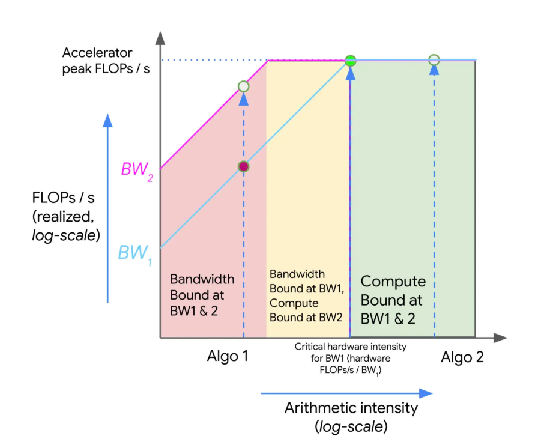

# Roofline Notes

## Time model

The source frames performance with three basic costs:

- math time
- memory or communication time
- inter-chip communication time

For communication, the source gives the simple model:

`T_comms = communication bytes / bandwidth`

With ideal overlap and pipelining:

`T_lower = max(T_math, T_comms)`

Without overlap:

`T_upper = T_math + T_comms`

The practical message is that the lower bound depends on whichever resource dominates.

## Arithmetic intensity

The source defines arithmetic intensity as:

`arithmetic intensity = FLOPs / communication bytes`

This is used to decide whether an operation is compute-bound or communication-bound:

- if `T_math > T_comms`, the workload is compute-bound
- if `T_math < T_comms`, the workload is communication-bound

The same roofline logic is also used informally for memory traffic.

## Roofline interpretation

The notes describe the standard roofline picture:

- low arithmetic intensity sits in the memory-bound region
- high arithmetic intensity moves into the compute-bound region
- performance can improve either by increasing arithmetic intensity or by increasing bandwidth

## Matmul intensity rule of thumb

For:

`X[B, D] * Y[D, F] -> Z[B, F]`

with bf16 inputs, the source notes:

- memory reads: `2BD + 2DF`
- memory writes: `2BF`
- compute: `2BDF`

So the intensity estimate is:

`Intensity(matmul) = 2BDF / (2BD + 2DF + 2BF) = BDF / (BD + DF + BF)`

The notes then give a useful approximation when batch is much smaller than the feature dimensions:

`Intensity(matmul) ≈ B`

The source conclusion is that, on many TPUs, bf16 matmul tends to become compute-bound only when the per-device token batch size is large enough.

## Communication roofline for distributed matmul

For a two-TPU matmul example, the source compares compute and communication directly:

- `T_math = (BDF) / 1.97e14`
- `T_comms = (2BF) / 4.5e10`

The note emphasizes that the compute-vs.-communication boundary can depend on model dimension `D`, not just batch size `B`, once communication enters the picture.

## BF16 notes

The source keeps a short numeric-format comparison among FP32, FP16, and BF16 and stresses one main point: dynamic range matters more than fine precision for many LLM workloads.

Key ideas preserved from the notes:

- BF16 keeps the same exponent width as FP32
- hardware conversion from FP32 to BF16 is simple and efficient
- accumulation is still typically performed in FP32 via fused multiply-add paths
- small values can be swallowed by much larger ones during summation, so accumulation order still matters

## Token and sequence terminology

The source also defines two basic terms for later sections:

- **token**: the smallest text unit processed by the model
- **sequence**: the full span of tokens processed together, often padded or fixed to a chosen length such as 4096 tokens
