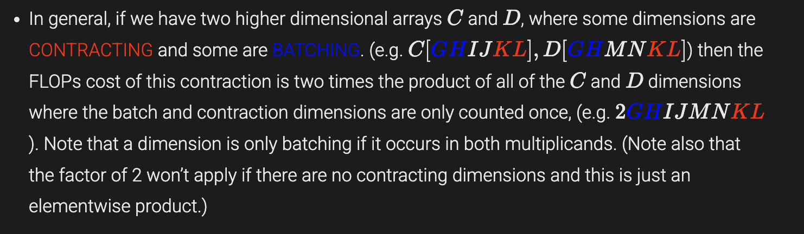

# Transformer Systems Notes

This note is a systems-oriented summary of how transformer training and inference spend **compute**, **memory**, and **communication**. The focus is on first-order cost models that are useful for scaling analysis, inference planning, and systems interviews.

> Scope: decoder-style transformer blocks, first-order FLOPs estimates, and the distinctions that matter in practice. Lower-order terms such as bias adds, residual adds, and norm ops are mentioned only when they change the systems story.

## Notation

| Symbol | Meaning |
| --- | --- |
| `B` | batch size |
| `T` | query sequence length |
| `S` | key/value sequence length |
| `L` | number of transformer layers |
| `D` | model dimension (`d_model`) |
| `F` | MLP hidden dimension |
| `H` | per-head dimension |
| `N` | number of query heads |
| `K` | number of KV heads |
| `G` | query heads per KV head, so `N = K * G` |
| `V` | vocabulary size |

In full-sequence training, self-attention usually has `T = S`. In autoregressive decoding, `T = 1` for the new token while `S` is the KV-cache length.

## FLOPs basics

For the standard contractions that show up repeatedly in transformer cost accounting:

| Operation | Shape | FLOPs |
| --- | --- | --- |
| dot product | `x[P] · y[P]` | `2P` |
| matrix-vector multiply | `A[N,P] @ x[P]` | `2NP` |
| matrix-matrix multiply | `A[N,P] @ B[P,M]` | `2NPM` |



These simple contractions are enough to explain the well-known transformer training rule of thumb.

## Why a training matmul is about 3x a forward matmul

Let:

`C = A @ B`, where `A` has shape `[N, P]` and `B` has shape `[P, M]`.

Then:

- forward pass: `2NPM`
- gradient w.r.t. weights: `dL/dB = A^T @ (dL/dC)` -> `2NPM`
- gradient w.r.t. activations: `dL/dA = (dL/dC) @ B^T` -> `2NPM`

Total training cost for the same matmul:

`6NPM`

This is the origin of the familiar estimate:

`training FLOPs per token ≈ 6 × active parameter count`

That estimate is useful, but only under the usual caveats: dense blocks, reasonable context lengths, and first-order accounting that ignores smaller terms.

## Transformer block: where the cost actually comes from


A useful systems split is:

1. **projection matmuls** (`Q`, `K`, `V`, `O`, and the MLP)
2. **core attention** (`QK^T`, softmax, and attention-weighted `V`)

That split matters because the two parts have different scaling behavior.

## MLP cost

For a **gated MLP** such as SwiGLU/GeGLU, the block uses two input projections and one output projection:

| Operation | Shape | Training FLOPs | Params |
| --- | --- | --- | --- |
| input projection 1 | `[B,T,D] @ [D,F]` | `6BTDF` | `DF` |
| input projection 2 | `[B,T,D] @ [D,F]` | `6BTDF` | `DF` |
| elementwise combine | `σ(A_in1) ⊙ A_in2` | `O(BTF)` | `0` |
| output projection | `[B,T,F] @ [F,D]` | `6BTDF` | `DF` |

So the first-order MLP budget is:

- **training FLOPs:** `≈ 18BTDF`
- **parameters:** `3DF`

> Note: if a model uses a classical 2-matmul GELU MLP instead of a gated MLP, replace this with `12BTDF` FLOPs and `2DF` params.

## Attention cost: projections vs. core attention

### 1. Projection matmuls

In generic GQA, the attention projections are:

```text
Q = X @ W_Q : [B,T,D] x [D,N,H] -> [B,T,N,H]
K = X @ W_K : [B,T,D] x [D,K,H] -> [B,T,K,H]
V = X @ W_V : [B,T,D] x [D,K,H] -> [B,T,K,H]
O = Y @ W_O : [B,T,N,H] x [N,H,D] -> [B,T,D]
```

These are ordinary matmuls with learnable weights. Their properties are what matter systemically:

- they introduce parameters
- they are token-local linear transforms
- they do **not** yet create token-to-token interaction

The first-order projection budget is:

- **training FLOPs:** `12BTD(N + K)H`
- **parameters:** `2D(N + K)H`

For the MHA special case `K = N`, this reduces to:

- **training FLOPs:** `24BTDNH`
- **parameters:** `4DNH`

### 2. Core attention

Now reshape query heads using:

`N = K * G`

so that `Q[B,T,N,H]` can be viewed as `Q[B,T,K,G,H]`.

The two expensive contractions are then:

```text
Scores = Q @ K^T : [B,T,K,G,H] x [B,S,K,H] -> [B,T,S,K,G]
Context = softmax(Scores) @ V : [B,T,S,K,G] x [B,S,K,H] -> [B,T,K,G,H]
```

This is the part of attention that:

- introduces **no new parameter matrices**
- creates **token-to-token interaction**
- scales strongly with sequence length
- is responsible for the large intermediate score tensor in a naive implementation

The first-order dot-product attention budget is:

- **training FLOPs:** `≈ 12BTSNH`
- **softmax:** lower-order relative to the big matmuls, but still important for implementation efficiency

Two details matter here:

1. With fixed `N`, the dot-product attention FLOPs scale with `N`, not with `K`. Reducing KV heads mainly saves **projection cost** and **KV cache**, not the asymptotic score/value FLOPs.
2. For **causal** attention, a mask-aware kernel can avoid work above the diagonal, cutting the useful `QK^T` / `AV` work by about half compared with full bidirectional attention.

## Why this split is useful

A clean mental model is:

| Part | What it does | What scales it |
| --- | --- | --- |
| projection matmuls | move representations between feature spaces | parameter count |
| core attention | exchange information across tokens | sequence length |

That distinction is why long-context serving becomes expensive even when the model parameter count is fixed.

## GQA, MHA, MQA, and dot-product attention are not competing labels

These names describe different axes of the design.

### Head geometry

| Variant | Query heads | KV heads | Meaning |
| --- | --- | --- | --- |
| MHA | `N` | `N` | every query head has its own KV head |
| GQA | `N` | `K < N` | multiple query heads share one KV head |
| MQA | `N` | `1` | all query heads share the same KV head |

### Score function

| Variant | Meaning |
| --- | --- |
| dot-product attention | scores come from `q · k` |
| additive attention | scores come from a learned additive compatibility function |
| cosine attention | scores are based on normalized similarity |
| linear attention | changes the attention computation with an alternative approximation or kernelization |

So a decoder layer can simultaneously be:

- **causal self-attention**
- **grouped-query attention**
- **scaled dot-product attention**

That is not redundant terminology; each label answers a different question.

## First-order per-layer cost summary

For a dense transformer block with a **gated MLP** and **generic GQA**:

| Component | Params | Training FLOPs | Notes |
| --- | --- | --- | --- |
| MLP | `3DF` | `18BTDF` | often the dominant dense term |
| Q/K/V/O projections | `2D(N + K)H` | `12BTD(N + K)H` | generic GQA |
| dot-product attention | `0` | `12BTSNH` | full attention; causal useful work is about half |
| norms / residual elementwise ops | lower-order | lower-order | usually ignored in first-pass estimates |
| final unembedding | `DV` | `6BTDV` | large, but not repeated per layer |

A useful special case is **MHA with** `K = N` **and** `D = NH`:

| Component | Params | Training FLOPs |
| --- | --- | --- |
| attention projections | `4DNH = 4D^2` | `24BTDNH = 24BTD^2` |
| gated MLP with `F = 4D` | `12D^2` | `72BTD^2` |

This makes it obvious why the MLP dominates dense parameter count in the usual decoder block.

## The short-context rule of thumb

If context is not long enough for dot-product attention to dominate, a dense transformer can be approximated by the large matmuls alone:

`FLOPs ≈ (18BTDF + 12BTD(N + K)H)L`

Equivalently:

`FLOPs ≈ 6 * BT * (3DF + 2D(N + K)H)L`

This is the cleanest route to the standard summary:

`training FLOPs ≈ 6 × total tokens × active parameters`

This is a **rule of thumb**, not a law. It assumes all of the following:

- dense blocks rather than sparse routing
- reasonable context lengths
- first-order accounting
- the gated-MLP convention used above

## When attention starts to matter

If we compare **full** dot-product attention with the main matmul budget of the block, and assume:

- `F = 4D`
- `D = NH`
- `N = K` (MHA)
- full attention with `T = S`

then:

`attention FLOPs / matmul FLOPs ≈ T / (8D)`

This is a useful thresholding heuristic:

- when `T << 8D`, the dense matmuls dominate
- as `T` grows, attention becomes a larger share of the budget

> Important caveat: for causal attention with a kernel that avoids useless upper-triangular work, the useful attention term is about half of full attention, so the ratio becomes roughly `T / (16D)`.

## KV cache: the inference term that shows up everywhere

The key systems fact for autoregressive inference is that KV cache size scales with the number of stored keys and values.

Per sequence, measured in **elements** rather than bytes:

`KV cache ≈ 2 * S * L * K * H`

Why `2`? Because both **K** and **V** are cached.

To convert that into memory bytes for batched serving:

`KV cache bytes ≈ 2 * B * S * L * K * H * bytes_per_element`

This is why GQA and MQA are so useful for inference: they reduce `K`, which directly reduces KV-cache memory and usually helps serving throughput as well.

## FlashAttention: what it changes and what it does not

FlashAttention does **not** change the asymptotic quadratic dependence of exact attention on sequence length. What it changes is the IO pattern.

The core implementation ideas are:

- do **not** materialize the full attention matrix in HBM
- process `K` and `V` in tiles
- keep running max / denominator / partial output for online softmax
- keep as much work as possible in on-chip SRAM / shared memory / VMEM

So the systems win is:

- lower memory traffic
- less pressure on HBM
- higher arithmetic intensity
- better wall-clock performance for the same exact attention computation

## Rematerialization / gradient checkpointing

Rematerialization is the cleanest example of a memory-vs.-compute trade-off in training.

- save fewer activations during forward
- recompute them later during backward
- reduce memory footprint
- pay extra FLOPs

This is why training cost is not just about forward + backward formulas in isolation; it also depends on how aggressively activations are retained versus recomputed.

## Sparse models and MoE

The MoE systems story is different from the dense-transformer story because **total parameters** and **active parameters per token** are no longer the same quantity.

For an MoE layer with `E` experts and top-`k` routing:

| Quantity | Dense MLP | MoE MLP |
| --- | --- | --- |
| total expert parameters | one MLP block | grows roughly with `E` |
| active parameters per token | one MLP block | grows roughly with `k` |
| routing | none | router selects top-`k` experts per token |
| communication | standard distributed training only | often adds expert dispatch + combine traffic |

A good first-order summary is:

- total parameters grow with the number of experts `E`
- per-token compute grows with the number of selected experts `k`
- in **expert-parallel** implementations, tokens are often shuffled to the devices that host their selected experts and then shuffled back, which is why MoE commonly introduces **two all-to-all exchanges**

That last point is a systems property of distributed expert placement. It is extremely important in practice, but it is not a mathematical requirement if all experts live on one device.

## Why matmul is so often the star of the show

For a roughly square GEMM, arithmetic work grows cubically with the shared dimension scale, while data movement grows quadratically. In other words:

- FLOPs scale like `O(n^3)`
- input/output movement scales like `O(n^2)`
- arithmetic intensity increases with problem size

That is why large matmuls are much easier to push toward compute saturation than operations such as softmax, normalization, or other elementwise kernels.

## Practical takeaways

If I need a compact systems checklist, it is this:

1. **Dense training:** first estimate with `6 × tokens × active params`.
2. **Long context:** separate projection cost from core-attention cost.
3. **Inference:** track KV-cache size explicitly; it often dominates serving constraints.
4. **GQA/MQA:** mostly save projection parameters and KV-cache memory.
5. **FlashAttention:** improves IO efficiency, not exact-attention asymptotics.
6. **MoE:** distinguish total params, active params, and communication overhead.
