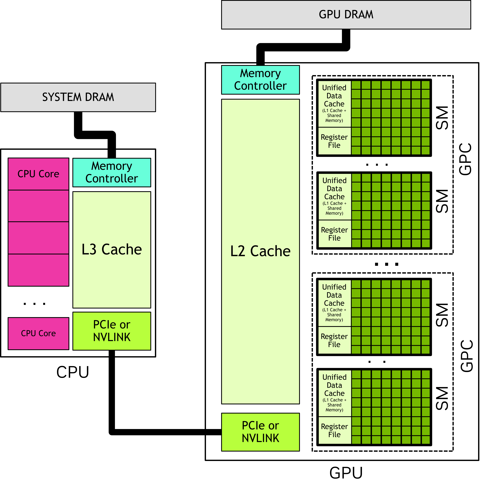

# Triton Overview

This note summarizes how I think about Triton and the Hopper-era GPU execution model behind high-performance LLM kernels. I keep the focus on concepts that are useful for custom kernel work and safe to show in a portfolio: blocked programming, CUDA execution hierarchy, cluster-level cooperation, and Hopper’s asynchronous data-movement model.

## 1. A DSA-style mental model

The diagram below is a **conceptual mapping**, not a strict one-to-one hardware equivalence.


### Buffer hierarchy

- **Local buffer:** on-chip storage close to compute. A rough GPU analog is **shared memory** plus the closest cache levels visible to an SM.
- **Global buffer:** on-chip storage shared more broadly across the chip. A rough GPU analog is **L2 cache**.
- **Off-chip DRAM:** external memory. On modern GPUs this usually means **HBM** or **GDDR**.

### Compute view

- **Scalar work:** a useful mental model for control flow, addressing, and scalar operations.
- **Vector / SIMD-style work:** a useful mental model for elementwise parallelism.
- **Matrix engines:** the closest GPU analog is **Tensor Cores**.

These are analogies, not literal hardware identities. A programmable accelerator core is not the same thing as a Tensor Core, even if both participate in matrix-heavy workloads.

## 2. Triton vs. CUDA

Triton changes the unit of abstraction. CUDA exposes a scalar program executed by many threads, while Triton encourages a **blocked program** that operates on tiles. The compiler and backend then map those blocked programs to GPU threads, warps, and memory operations.

In practice, that means:

- Triton is often more productive for custom kernels.
- Performance still depends on choosing the right meta-parameters such as tile sizes, `num_warps`, `num_stages`, and on SM90+ GPUs, `num_ctas`.
- Hand-tuned CUDA can still win in highly specialized kernels, but Triton is already competitive for workloads such as matrix multiplication, attention, and fused kernels.

Historically, Triton kernels were mostly reasoned about at the CTA level. On Hopper-class GPUs, Triton can also target **block clusters** through the `num_ctas` configuration knob.

## 3. CTA refresher

A **CTA (Cooperative Thread Array)** is the CUDA term for a **thread block**.

- All threads in a CTA run on the same SM.
- Threads within a CTA can communicate through **shared memory**.
- Threads within a CTA can synchronize with barriers such as `__syncthreads()`.
- Different CTAs are scheduled independently, so cross-CTA cooperation requires extra hardware and software support.

This is why Triton feels much closer to **block-level reasoning** than to explicit per-thread scheduling.

## 4. Hopper thread block clusters

Hopper adds an optional hierarchy level between the grid and the block: the **thread block cluster**.

### What changes with clusters



- Blocks in the same cluster are guaranteed to run concurrently on SMs within the same **GPC(GPU Processing Cluster)**.
- Blocks in a cluster can read, write, and perform atomics on one another’s shared memory.
- NVIDIA refers to this cluster-visible shared memory space as **Distributed Shared Memory (DSMEM)**.
- Cross-block synchronization inside a cluster is available through `cooperative_groups::cluster_group` and `cluster.sync()`.
- Intra-cluster (Inside): Co-scheduled & Simultaneous.
- Inter-cluster (Between): Randomly scheduled & Independent.

### Why this matters

Clusters extend the working set and communication scope beyond a single block. That creates a useful middle ground between:

- **local shared memory**, which is fast but limited to one block, and
- **global memory**, which is flexible but much slower for repeated fine-grained communication.

For some kernels, DSMEM lets you keep intermediate communication on chip instead of round-tripping through global memory.

### Practical notes

- `__cluster_dims__(x, y, z)` sets cluster dimensions at compile time.
- Cluster dimensions can also be configured at runtime with `cudaLaunchKernelEx`.
- The grid is still expressed in **blocks**, so the total number of launched blocks should be a multiple of the cluster size.
- The **portable** maximum cluster size is **8 blocks**. Hopper H100 can opt into a **nonportable** cluster size of 16.

### Minimal CUDA example

```cpp
#include <cooperative_groups.h>
namespace cg = cooperative_groups;

__global__ void __cluster_dims__(2, 1, 1) cluster_demo(int* out) {
    __shared__ int smem;

    cg::cluster_group cluster = cg::this_cluster();
    int block_rank = cluster.block_rank();

    if (threadIdx.x == 0 && block_rank == 0) {
        smem = 99;
    }

    // Ensure block 0 has written before block 1 reads.
    cluster.sync();

    if (threadIdx.x == 0 && block_rank == 1) {
        int* peer = cluster.map_shared_rank(&smem, 0);
        out[0] = *peer;
    }

    // Ensure remote DSMEM access finishes before either block exits.
    cluster.sync();
}
```

## 5. Triton knobs that matter on Hopper

### `num_ctas`

In Triton, `num_ctas` configures the number of blocks in a **block cluster** on SM90+ GPUs.

```python
triton.Config(
    {
        'BLOCK_SIZE_M': 128,
        'BLOCK_SIZE_N': 128,
        'BLOCK_SIZE_K': 64,
        'GROUP_SIZE_M': 8,
    },
    num_stages=7,
    num_warps=8,
    num_ctas=2,
)
```

A value such as `num_ctas=2` means that Triton should compile the kernel for a 2-block cluster rather than a single independent CTA.

### `GROUP_SIZE_M`

`GROUP_SIZE_M` controls **program ordering** in Triton matmul-style kernels. The point is not to change the math, but to change the order in which output tiles are visited so the kernel gets better **temporal locality** and higher **L2 reuse**.

Instead of a simple row-major traversal, Triton groups several tiles along the M dimension before moving across N. In the official matrix multiplication tutorial, this grouped ordering reduces the number of blocks loaded into SRAM from **90 to 54** in a 9-by-9 example, and can improve performance by more than 10% on some hardware.

### Core matmul parameters

A standard Triton matmul kernel usually has four kinds of inputs:

- **Pointers:** `a_ptr`, `b_ptr`, `c_ptr`
- **Global dimensions:** `M`, `N`, `K`
- **Strides:** `stride_am`, `stride_ak`, `stride_bk`, `stride_bn`, ...
- **Meta-parameters:** `BLOCK_SIZE_M`, `BLOCK_SIZE_N`, `BLOCK_SIZE_K`, `GROUP_SIZE_M`

The most important practical point is that **strides define how a logical tensor maps to physical memory**, while **block sizes define which tile each Triton program instance computes**.

## 6. Tensor Memory Accelerator (TMA)

Hopper introduces the **Tensor Memory Accelerator (TMA)** for bulk asynchronous copies.

### What TMA changes

Compared with older global-to-shared copy flows, TMA moves more of the work into dedicated hardware:

- a thread issues a **descriptor-based** copy,
- the descriptor carries tensor shape, strides, and block coordinates,
- address generation and bulk data movement are handled by hardware,
- synchronization is tied to **barriers** that track both thread arrival and transfer completion.

This reduces per-element address-generation overhead and makes it easier to overlap data movement with computation.

### Supported directions and cluster behavior

On Hopper-class GPUs, TMA supports bulk copies such as:

- **global → shared::cta**
- **global → shared::cluster**
- **shared::cta → global**
- **shared::cta → shared::cluster**

Within a cluster, TMA also supports **multicast**, where one global-memory read can populate the shared memory of multiple blocks. In CUDA’s documentation, this multicast path is specifically optimized for **`sm_90a`**.

### Barrier model

Hopper also introduces the **asynchronous transaction barrier** model used by TMA-style transfers.

The key idea is that the barrier does not only count whether threads have arrived. It also tracks whether the expected number of bytes has arrived. A wait only completes when:

1. participating threads have arrived, and
2. the expected transaction count has been satisfied.

That is a more precise model than a pure control-flow barrier such as `__syncthreads()`.

## 7. Tensor descriptors in Triton

Triton exposes descriptor-style access through `tl.make_tensor_descriptor`.

```python
import triton.language as tl

@triton.jit
def kernel(a_ptr, M, K,
           BLOCK_M: tl.constexpr,
           BLOCK_K: tl.constexpr):
    desc = tl.make_tensor_descriptor(
        a_ptr,
        shape=[M, K],
        strides=[K, 1],
        block_shape=[BLOCK_M, BLOCK_K],
    )

    m_offset = tl.program_id(0) * BLOCK_M
    k_offset = 0
    a = desc.load([m_offset, k_offset])
```

On NVIDIA GPUs with TMA support, loads and stores through such a descriptor are backed by **TMA hardware**.

A few practical constraints matter:

- the base pointer must be **16-byte aligned**,
- leading-dimension strides must respect Triton’s descriptor alignment rules,
- the last dimension must be contiguous,
- current support is limited to **2D to 5D tensors**.

## 8. Why this matters for LLM kernel work

For LLM-oriented kernels, these features matter because they target the two bottlenecks that appear over and over again:

- **math throughput**, where tile shape and Tensor Core feeding matter,
- **data movement**, where locality, on-chip reuse, and asynchronous pipelines dominate.

A practical mental model is:

- use **blocked programming** to express the computation cleanly,
- use **grouped ordering** to improve cache reuse,
- use **clusters / DSMEM** when cross-block cooperation is valuable,
- use **descriptors and TMA** when bulk tensor movement becomes the bottleneck.

## 9. References

### ToDo

- [CUDA Programming Guide: asynchronous copies and TMA](https://docs.nvidia.com/cuda/cuda-programming-guide/04-special-topics/async-copies.html)
- [NVIDIA Hopper Architecture In-Depth](https://developer.nvidia.com/blog/nvidia-hopper-architecture-in-depth/)
- [Zhihu note](https://zhuanlan.zhihu.com/p/672086654)
