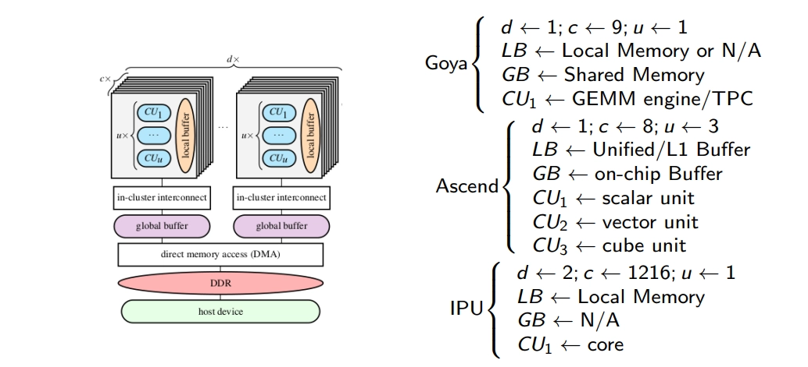

# Triton Overview

This note summarizes how I think about Triton and the Hopper-era GPU execution model behind high-performance LLM kernels. I focus on the concepts that are most useful for custom kernel work: blocked programming, the CUDA execution hierarchy, and cluster-level cooperation.

## 1. A DSA-style mental model

The diagram below is a **conceptual mapping**, not a strict one-to-one equivalence.



### Buffer hierarchy

- **Local buffer:** on-chip storage close to compute. A rough GPU analog is **shared memory** plus the closest cache levels touched by an SM.
- **Global buffer:** on-chip storage shared more broadly across the chip. A rough GPU analog is **L2 cache**.
- **Off-chip DRAM:** external memory. On modern GPUs this usually means **HBM** or **GDDR**.

### Compute view

- **Scalar work:** useful mental model for control flow, addressing, and scalar operations.
- **Vector / SIMD-style work:** useful mental model for elementwise parallelism.
- **Matrix engines:** the closest GPU analog is **Tensor Cores**.

These are analogies, not literal hardware identities. For example, a programmable accelerator core is not the same thing as a Tensor Core even if both participate in matrix-heavy workloads.

## 2. Triton vs. CUDA

Triton changes the unit of abstraction. CUDA exposes a scalar program executed by many threads; Triton encourages a **blocked program** that operates on tiles. The compiler and backend then map those blocked programs to GPU threads and warps.

In practice, that means:

- Triton is usually more productive for custom GPU kernels.
- You still control important performance knobs such as tile sizes, `num_warps`, `num_stages`, and on SM90+ GPUs, `num_ctas`.
- Hand-tuned CUDA may still win in the most specialized kernels, but Triton is highly competitive for workloads such as matrix multiplication, attention, and fused pointwise kernels.

## 3. CTA refresher

A **CTA (Cooperative Thread Array)** is the CUDA term for a **thread block**.

- All threads in a CTA execute concurrently on the same SM.
- Threads within the CTA can communicate through **shared memory**.
- Threads within the CTA can synchronize with barriers such as `__syncthreads()`.
- Different CTAs are scheduled independently, so cross-CTA dependencies require special mechanisms.

This matters because Triton is much closer to **block-level** reasoning than to explicit per-thread scheduling.

## 4. Hopper thread block clusters

Hopper adds an optional hierarchy level between the grid and the block: the **thread block cluster**.

### What changes with clusters

- Blocks in the same cluster are guaranteed to run concurrently on SMs within the same **GPC**.
- Blocks in a cluster can read, write, and perform atomics on one another's shared memory.
- NVIDIA refers to this cluster-visible shared memory space as **Distributed Shared Memory (DSMEM)**.
- Cross-block synchronization inside a cluster is available through `cooperative_groups::cluster_group` and `cluster.sync()`.

### Why this matters

Thread block clusters extend the working set and communication scope beyond a single block. That creates a useful middle ground between:

- **local shared memory**, which is fast but limited to one block, and
- **global memory**, which is flexible but much slower for repeated fine-grained communication.

For some kernels, DSMEM lets you keep intermediate communication on chip instead of round-tripping through global memory.

### Practical notes

- `__cluster_dims__(x, y, z)` sets cluster dimensions at compile time.
- Cluster dimensions can also be configured at runtime with `cudaLaunchKernelEx`.
- The grid is still expressed in **blocks**, so the total number of launched blocks should be a multiple of the cluster size.
- The **portable** maximum cluster size is **8 blocks**. Hopper H100 can opt into a **nonportable** cluster size of 16.

### Minimal CUDA example

```cpp
#include <cooperative_groups.h>
namespace cg = cooperative_groups;

__global__ void __cluster_dims__(2, 1, 1) cluster_demo(int* out) {
    __shared__ int smem;

    cg::cluster_group cluster = cg::this_cluster();
    int block_rank = cluster.block_rank();

    if (threadIdx.x == 0 && block_rank == 0) {
        smem = 99;
    }

    // Ensure both blocks exist and block 0 has written its value.
    cluster.sync();

    if (threadIdx.x == 0 && block_rank == 1) {
        int* peer = cluster.map_shared_rank(&smem, 0);
        out[0] = *peer;
    }

    // Ensure remote DSMEM access finishes before either block exits.
    cluster.sync();
}
```

A matching launch would still use the normal CUDA syntax, for example `cluster_demo<<<2, 32>>>(out)`, because the grid size is still specified in **blocks**.

## 5. References

- [Triton Notes — Zhihu](https://zhuanlan.zhihu.com/p/672086654)
