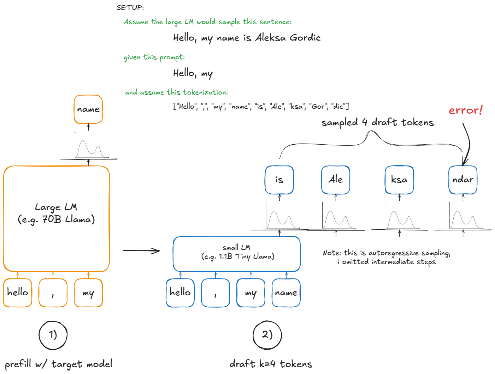
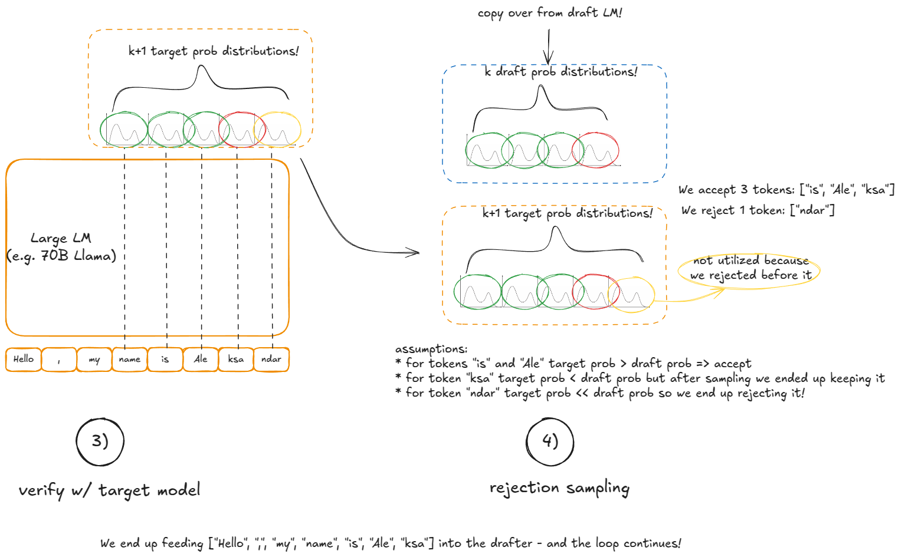
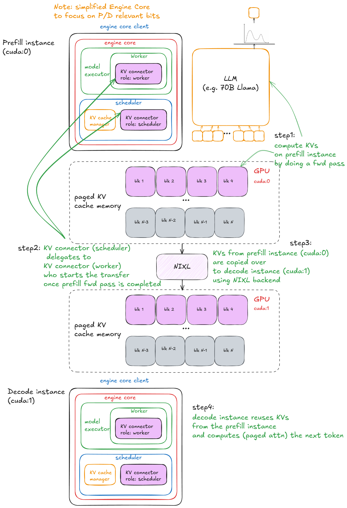

# Advance Features

## Chunked Prefill

**Motivation:** avoid letting a very long prefill occupy the engine and block other requests(eg generation).

**Mechanism:** Split a long prompt into chunks and process them incrementally. Later chunks can directly reuse the KV cache computed by earlier chunks, avoiding redundant computation while controlling scheduling latency per step.

**Question:** could the scheduler estimate work by KV-cache load / memory traffic, rather than only by the current number of generated tokens?

---

## Prefix Caching

### Motivation & Usage

- Avoid repeatedly prefilling the same prefix across multiple requests.
- Reuse KV cache across requests.
- Common cases:
  - system prompts
  - RAG (Retrieval-Augmented Generation) context
  - multiple users sharing the same beginning

### Mechanism

- Tokens are segmented into fixed-size blocks.
- Each block is identified by a **chained hash**:
  $$\text{hash}_i = \text{hash}(\text{hash}_{i-1},\ \text{tokens}_i)$$
- KV cache is stored and indexed per block using these hashes, enabling O(1) lookup and reuse for any matching prefix.

---

### Open questions

**Question:** exact prefix matching is a very strict requirement. For many web-search or document-heavy cases, there may be large middle spans that are identical even when the prompt is not identical from the beginning. For example, if a 16k-token webpage contains many repeated 1k-token blocks, there can still be a lot of redundant computation even though standard prefix caching cannot reuse it directly. How could that case be optimized?

- More broadly, taking raw webpage text, tokenizing it, and then converting it into KV cache still feels like an inefficient path. Is there a better abstraction?
- Another thought: instead of treating a conversation as one single thread from beginning to end, could we treat it as multiple fresh conversations so repeated webpage KV becomes reusable? The remaining problem is how to make use of several conversations that each restart from the beginning.
- Even without prefix caching, storing KV cache is itself a memory-for-compute trade-off.
- Since KV cache stores precomputed key/value states rather than final attention outputs, is there any analogous idea to online softmax that would let part of the attention work be reused while the rest is updated incrementally?

---

## Speculative Decoding

### Motivation

During decoding, the target model produces only **one token per forward pass**. Large models are typically **memory-bandwidth-bound** at this stage due to repeated KV cache reads, kernel launches, and cross-device synchronization — all of which drive up **inter-token latency (ITL)**.

### Core idea

1. A small, cheap **draft model** autoregressively samples K candidate tokens.
2. The large **target model** verifies all K tokens in a **single parallel forward pass**, producing K+1 probability distributions.

### Acceptance

Let $p_i$ be the target model's probability and $q_i$ be the draft model's probability for the $i$-th draft token $d_i$.

The acceptance probability for token $d_i$ is:

$$a_i = \min\!\left(1,\ \frac{p_i(d_i)}{q_i(d_i)}\right)$$

- If $p_i(d_i) \geq q_i(d_i)$: always accept.
- Otherwise: accept with probability proportional to the ratio.

### Rejection

- Check draft tokens from left to right and stop at the first rejection.
- After a rejection, we do **not** simply keep the draft token, and we also do **not** just take the target model's favorite token. Instead, we resample from the correction distribution `norm(max(0, p_i - q_i))`.

### Extra token

- Only when all `K` draft tokens are accepted can we also get the `(K+1)`-th token from the target model in the same verification pass.

### Why faster

The real gain comes from **reducing the number of target model forward passes** while still generating multiple tokens per step. This amortizes the cost of repeated weight loading, KV cache access, kernel launches, and multi-GPU synchronization.

### When it works well

- the drafter must be cheap enough
- its distribution must be close enough to the target so the acceptance rate is high
- the actual gain from speculative decoding depends heavily on draft latency

## Disaggregated Prefill / Decode

### Core idea

Separate the prefill phase (compute-bound) and the decode phase (memory-bandwidth-bound) onto dedicated workers/GPUs/nodes, allowing each to be independently optimized.

### Execution flow

1. Incoming request is routed to a **Prefill Worker**.
2. The Prefill Worker runs a forward pass on the prompt, generating the full **KV cache**.
3. The KV cache is **transferred (KV handoff)** to the Decode Worker — e.g., via NIXL over NVLink or RDMA.
4. The **Decode Worker** reuses the received KV cache and autoregressively generates output tokens.

### Benefits

- **Decouples TTFT and ITL**: prefill latency no longer interferes with decode throughput.
- Eliminates the tail-latency problem where a long prompt stalls ongoing decode batches.
- Each resource pool can scale independently based on workload characteristics.

### Trade-offs

- Incurs an additional **KV transfer cost** between instances.
- Requires careful **bandwidth management and overlap** across GPUs or nodes.

### Idea

Pay a one-time KV transfer cost to unlock **independent optimization and horizontal scalability** of both prefill and decode stages.
