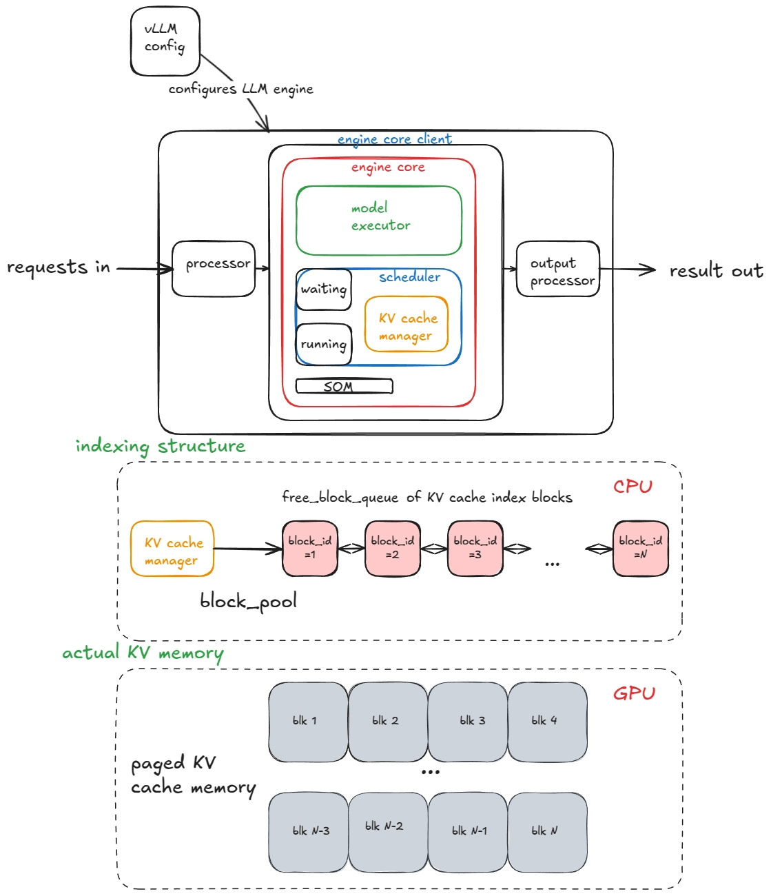
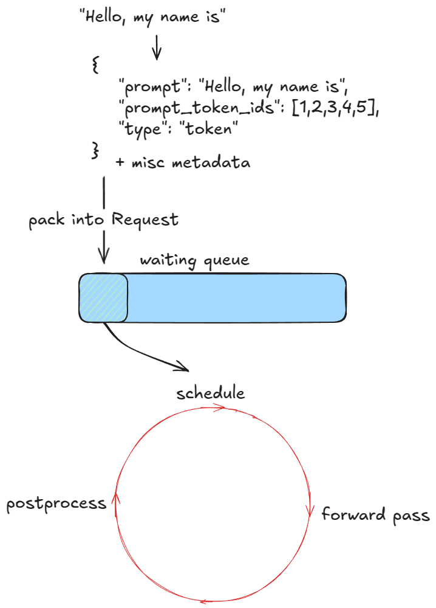
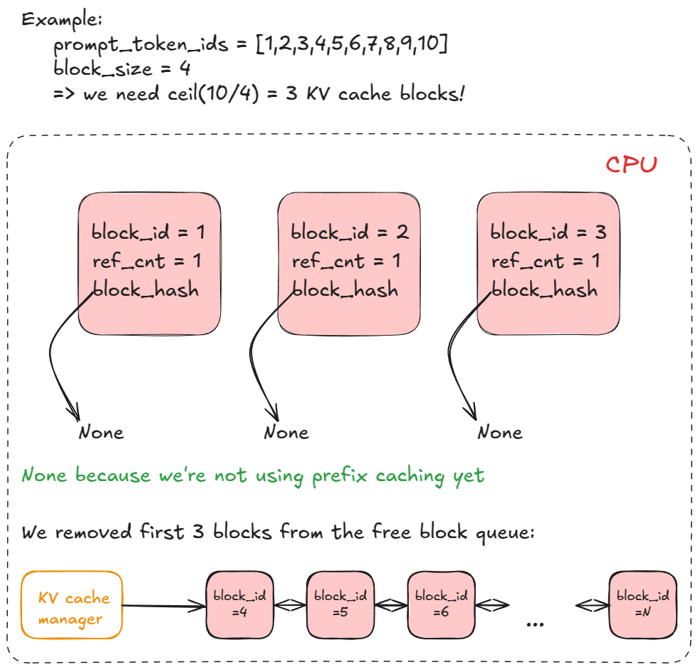
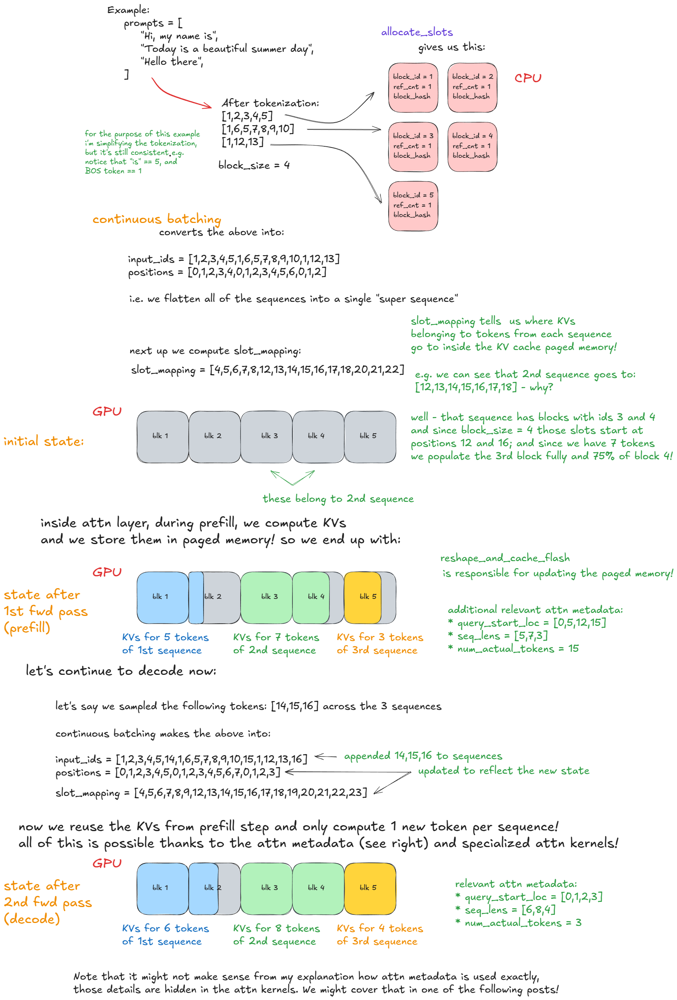

# LLM Engine Architecture



The engine is structured as a layered pipeline:

```
requests in → Processor → [Engine Core: Scheduler + Model Executor] → Output Processor → result out
```

The **engine core client** acts as the external interface, while the **engine core** contains the actual scheduling and execution logic. This separation enables distributed deployments where a client proxy dispatches work to remote engine cores via RPC.

---

## Processor

Responsible for **input tokenization, validation**, and packaging requests into `EngineCoreRequest` objects. On the output side, it handles **detokenization** and converts `EngineCoreOutputs` back into user-visible `RequestOutput`.

## Tokenization: Two Tables

| Table            | Content                                         | Location |
| ---------------- | ----------------------------------------------- | -------- |
| Tokenizer vocab  | string → token_id mappings + tokenization rules | CPU      |
| Embedding matrix | token_id → embedding vector                     | GPU HBM  |

After execution, the output side performs detokenization and converts internal engine outputs into a user-visible response object.

## `EngineCoreRequest` Structure

`EngineCoreRequest` is a **request-level** structure, not a token-level one. It packages the prompt, generation parameters, and scheduling metadata needed by the engine.

```cpp
EngineCoreRequest = {
  request_id,         // unique request identifier
  prompt_token_ids,   // tokenized prompt
  sampling_params,    // temperature / top_p / max_tokens / ...
  arrival_time,       // request arrival timestamp
  priority,           // optional scheduling priority
  data_parallel_rank, // target DP worker if applicable
  // optional: LoRA, prompt adapters, multimodal payloads, cache metadata, ...
}
```

### Key fields

| Field                | Meaning                                      | Why it matters                                                                       |
| -------------------- | -------------------------------------------- | ------------------------------------------------------------------------------------ |
| `request_id`         | Unique identifier for one request            | Used for scheduler bookkeeping, KV-cache ownership, and streaming output routing     |
| `arrival_time`       | Timestamp when the request enters the engine | Needed for FCFS/fairness policies and latency accounting                             |
| `priority`           | Optional priority level                      | Allows the scheduler to prioritize urgent requests                                   |
| `sampling_params`    | Generation policy                            | Controls decoding behavior such as temperature, top-p, and max tokens                |
| `data_parallel_rank` | Assigned DP worker                           | Maps the request to a worker in distributed execution                                |
| `cache_salt`         | Optional cache-isolation key                 | Prevents unintended prefix-cache sharing across requests that should remain isolated |

---

## Scheduler

Decides **which requests to execute in the next engine step**.

- **Scheduling policies**: FCFS (first-come, first-served) or priority-based
- **Request queues**: maintains a `waiting` queue and a `running` queue
- Closely coupled with the **KV Cache Manager** — scheduling decisions are gated by available KV cache blocks

## KV Cache Manager

The KV Cache Manager abstracts GPU memory into a **paged block system**, inspired by virtual memory paging.

### Block Definition

A single block covers one layer and a contiguous token range:

```
block = (layer l, tokens [i ... i + block_size - 1])
```

Each block stores the key and value tensors for that layer and token range.

### Capacity Calculation

- Blocks per layer per sequence: `ceil(seq_len / block_size)`
- Total blocks per sequence: `num_layers × ceil(seq_len / block_size)`

**Example**:

- `num_layers = 80`
- `block_size = 16`
- `seq_len = 35`

Then:

- blocks per layer = `ceil(35 / 16) = 3`
- total blocks = `80 * 3 = 240`

### Block Size Formula (Standard Transformer, non-MLA)

```
bytes_per_block = 2 (K+V) × block_size × num_kv_heads × head_size × dtype_bytes
```

For bf16: `dtype_bytes = 2`

---

### Indexing Structure vs. Actual KV Memory

The design separates **control plane (CPU)** from **data plane (GPU)**:

| Layer                  | Location | Contents                                                                                   |
| ---------------------- | -------- | ------------------------------------------------------------------------------------------ |
| **Indexing structure** | CPU      | `free_block_queue`, `block_pool` metadata, per-sequence block tables, token→block mappings |
| **Actual KV memory**   | GPU HBM  | Real K tensors and V tensors, stored in paged block layout                                 |

The `free_block_queue` holds `block_id` integers — not actual KV data. This is a lightweight index that enables O(1) block allocation and deallocation.

### Runtime Behavior

1. **Initialization**: pre-allocate a large contiguous HBM region, partition into fixed-size blocks
2. **New request / prefill**: allocate blocks proportional to prompt length
3. **Decode step**: if the last block is full, allocate one new block; otherwise reuse it
4. **Request completion**: return all blocks to the free queue

### Why Paged Blocks vs. Contiguous Allocation

| Contiguous allocation                    | Paged blocks                             |
| ---------------------------------------- | ---------------------------------------- |
| Must pre-reserve max possible length     | Grows on demand                          |
| Severe fragmentation                     | Minimal fragmentation                    |
| Hard to batch requests of varied lengths | Scheduler can freely mix request lengths |
| Simple address arithmetic                | Requires block table indirection         |

---

# Model Executor

Drives the **forward pass** of the model.

- Receives a scheduled batch from the scheduler: token IDs + block tables
- Prepares the corresponding tensors
- Invokes CUDA kernels (attention, feed-forward, etc.)
- The block table is passed to the attention kernel so it can locate the correct KV blocks in GPU memory

---

## SOM — Structured Output Manager

`SOM` (Structured Output Manager) is integrated into the engine core to support **guided decoding** — constraining model outputs to conform to a specified schema (e.g., JSON, regex, context-free grammar). Token sampling is masked at each step to enforce structural validity.

---

## Engine Core Client & Engine Core

The engine is split into two layers:

| Layer                  | Role                                                                  |
| ---------------------- | --------------------------------------------------------------------- |
| **Engine Core Client** | External-facing interface; acts as a business-logic proxy             |
| **Engine Core**        | Internal host-side management logic (scheduling, KV cache, execution) |

This separation becomes critical for **large-scale deployments** requiring Tensor Parallelism (TP) or Pipeline Parallelism (PP) across multiple nodes. The client acts as a front-end proxy, forwarding requests to remote Engine Core instances via RPC.

---

## RPC in LLM Inference

### Why RPC Is Needed

- **Cross-node orchestration**: a master node receives user requests and dispatches tasks to worker nodes
- **Disaggregated serving**: when prefill and decode are separated onto different machine groups, RPC coordinates task handoff and state transfer

### Control Plane vs. Data Plane

| Plane             | Protocol         | Content                                                                                  | Characteristics                  |
| ----------------- | ---------------- | ---------------------------------------------------------------------------------------- | -------------------------------- |
| **Control plane** | RPC (gRPC / Ray) | Request metadata: request ID, token count, generation params, KV cache block assignments | Small payload, ultra-low latency |
| **Data plane**    | NCCL             | Tensor data: TP all-reduce, cross-node KV cache / activation transfer                    | High bandwidth, GPU-direct       |

### RPC Performance Considerations

Key sources of overhead in RPC:

1. **Serialization / deserialization** — encoding and decoding message payloads
2. **Network transport** — kernel/user-space context switch overhead
3. **Copy count** — number of memory copies along the send/receive path

Minimizing these is critical for keeping control-plane latency below the compute time of a single decode step.

## Request Lifecycle



Every incoming prompt goes through three stages that repeat in a tight loop:

```
waiting queue → schedule → forward pass → postprocess → (loop)
```

### Step I: Request Ingestion

- **Assign a request ID** and record the arrival timestamp.
- **Preprocess**: tokenize the prompt; produce `prompt`, `prompt_token_ids`, and a `type` tag (`string` / `token_id` / `embedding`).
- **Pack into `EngineCoreRequest`**: attach priority, sampling parameters, and other metadata.
- **Enqueue**: wrap into a `Request` object and push to the **waiting queue**.

### Step II: Engine Loop — `step()`

The engine repeatedly calls `step()`. Each call covers three phases:

- **Schedule** Select which requests to run this iteration (decoding or chunked prefill)
- **Forward pass** Run the model; sample the next token |
- **Postprocess** Append sampled token IDs to each request; detokenize; check stopping criteria. Free KV cache for completed requests and return outputs.

## Memory Management: Paged KV Cache



vLLM manages GPU memory for KV caches using a **paged memory** scheme inspired by OS virtual memory. Instead of pre-allocating a contiguous buffer per request, it divides the KV cache into fixed-size **blocks** and allocates them on demand.

### Core Design: Paged Memory Scheme

- The Problem: Traditional LLM inference frameworks pre-allocate a large, contiguous buffer for each request based on the maximum possible sequence length. This leads to severe memory waste and fragmentation.

- The vLLM Solution: Inspired by Operating System virtual memory, vLLM divides the KV cache into fixed-size blocks (acting like OS pages).

- On-Demand Allocation: Instead of allocating memory all at once, physical blocks are allocated dynamically and on demand as new tokens are generated, maximizing GPU memory utilization.

### CPU vs. GPU Division of Labor (Metadata vs. Data)

- vLLM decouples data storage from state management, functioning similarly to an OS Memory Management Unit (MMU):
- GPU (Data Plane): Stores the actual KV tensor data, which consumes the vast majority of the memory.
- CPU (Control Plane): Acts as the "bookkeeper" managing the metadata. The CPU maintains a Block Table that tracks:
- Mapping: The logical-to-physical block mapping (e.g., physical offset, idx).
- Status: The current state of each physical block (e.g., free, allocated, or reference counts—which is highly crucial for memory sharing during complex decoding like Beam Search).

### Micro-structure of a Block

- Internal Contiguity: While different blocks can be physically non-contiguous in the GPU memory, the memory space within a single physical block is strictly contiguous.
- Token Granularity: A block contains the KV data for a fixed number of tokens (e.g., if block_size = 16, the block stores the KV cache for exactly 16 tokens).
- Layer Isolation: The KV cache is computed per Transformer layer. Therefore, a single block strictly stores the Key and Value vectors for those continuous N tokens belonging to the same attention layer.

### Block Allocation

For a prompt of `N` tokens with `block_size = B`, the system allocates `⌈N / B⌉` blocks.

**Example:** `prompt_token_ids = [1,2,3,4,5,6,7,8,9,10]`, `block_size = 4`
→ requires `⌈10/4⌉ = 3` KV cache blocks.

Each **CPU-side block descriptor** carries three fields:

| Field        | Purpose                                                     |
| ------------ | ----------------------------------------------------------- |
| `block_id`   | Unique block identifier                                     |
| `ref_cnt`    | Reference count (supports copy-on-write and prefix sharing) |
| `block_hash` | Hash of the token content (used for prefix caching / APC)   |

When prefix caching is not active, `block_hash` is unused. The **KV cache manager** maintains a **free block queue**; blocks are dequeued when a request is scheduled and re-enqueued when the request completes.

### Slot Mapping and Continuous Batching



Continuous batching **flattens** all active sequences into a single "super-sequence" for each forward pass, enabling the GPU to process multiple requests in one kernel call.

**Example — three prompts after tokenization (`block_size = 4`):**

```
Sequence 1: [1, 2, 3, 4, 5]           →  5 tokens  →  2 blocks (ids 1, 2)
Sequence 2: [1, 6, 5, 7, 8, 9, 10]   →  7 tokens  →  2 blocks (ids 3, 4)
Sequence 3: [1, 12, 13]               →  3 tokens  →  1 block  (id  5)
```

**Flattened input fed to the model:**

```
input_ids = [1,2,3,4,5, 1,6,5,7,8,9,10, 1,12,13]
positions  = [0,1,2,3,4, 0,1,2,3,4,5,6,  0,1,2  ]
```

**`slot_mapping`** tells the attention kernel exactly which slot in paged GPU memory each token's KV pair should be written to.

For sequence 2 (blocks 3 & 4, `block_size = 4`): block 3 starts at slot 12, block 4 at slot 16. With 7 tokens, block 3 is fully populated and 75% of block 4 is used.

```
slot_mapping = [4,5,6,7,8, 12,13,14,15,16,17,18, 20,21,22]
```

**Attention metadata after the prefill forward pass:**

```
query_start_loc = [0, 5, 12, 15]
seq_lens        = [5, 7, 3]
num_actual_tokens = 15
```

During **decode**, each sequence contributes exactly one new query token. The engine reuses all cached KVs and only computes KV pairs for the new tokens. The kernel `reshape_and_cache_flash` is responsible for writing the new KVs into the correct paged memory slots in-place.

---

## Scheduler

### Continuous Batching

The scheduler maintains an **active batch** that is re-evaluated at every `step()`. It checks:

1. Which requests are still alive (in the decode phase).
2. Which new requests in the waiting queue are ready for prefill.
3. The remaining **token budget**, KV cache block capacity, and free GPU memory.

It then fills the active batch to capacity within those constraints.

- **Decode phase**: each active request generates exactly one token per step; the scheduler loops over all decode requests every iteration.
- **Prefill phase**: a new request must have its entire prompt processed (possibly across multiple chunked steps) before it can enter the decode phase.

### Chunked Prefill

Instead of processing a full prompt in a single forward pass, vLLM can split it into **chunks** that are processed sequentially. This prevents a very long prompt from monopolizing GPU time and starving decode requests.

**How attention works across chunks:**
Decoder-only LLMs use causal attention — each position may only attend to its left context. Chunks are processed in order, with each chunk reading the KV cache produced by all prior chunks:

```
chunk1 (tokens   1–300) → computes and caches KV for prefix [1..300]
chunk2 (tokens 301–600) → attends to cached [1..300], extends cache to [1..600]
```

This is semantically equivalent to full-prompt attention; it simply reformulates it as an **incremental causal computation** that accumulates the KV cache prefix by prefix.

### Token Budget: `max_num_batched_tokens`

`max_num_batched_tokens` is the **total token count budget per forward pass** — the ceiling on the number of tokens (across all requests) that can participate in one `step()`.

| Token type        | Computation                                                                           |
| ----------------- | ------------------------------------------------------------------------------------- |
| **Decode token**  | One query token per active request; attends over the full cached KV sequence          |
| **Prefill token** | Each token in the chunk requires QKᵀ (within chunk + past KV), softmax, and V-combine |

**Tuning trade-offs:**

| Budget size | Effect                                                                                                     |
| ----------- | ---------------------------------------------------------------------------------------------------------- |
| Smaller     | Lower inter-token latency (ITL); decode requests are less delayed by prefill work                          |
| Larger      | Higher throughput and lower TTFT (time-to-first-token); better GPU utilization for prefill-heavy workloads |

For small models on large GPUs, a larger budget (e.g., 8192 tokens) is generally preferred to maximize throughput.

**Scheduler design philosophy:**
The scheduler does not perform fine-grained byte-level HBM optimization. It solves a practical, tractable problem:

> _Given this step's token budget and KV cache capacity, maximize decode throughput while preventing prefill requests from being starved._

### Decode + Prefill Mixed Batching

vLLM's policy: **decode requests are scheduled first**; the remaining token budget is allocated to chunked prefill. If a single prefill chunk exceeds the remaining budget, it is split automatically.

**Example** — one step on a node with 8 GPUs (TP=8, PP=1):

```
Decode:  80 requests × 1 token each                          =   80 tokens
Prefill: R1 chunk1 (300) + R2 chunk4 (300)
       + R3 chunk1 (256) + R4 chunk2 (512)                   = 1368 tokens
─────────────────────────────────────────────────────────────────────────
Total batched tokens this step:                              = 1448 tokens
```

All 8 GPUs participate in one joint forward pass over this entire mixed batch as a single tensor-parallel group. The KV cache is **sharded across GPUs**: each GPU stores only the heads / shard it is responsible for, rather than a full replica.

### Chunked Prefill Scheduling Constraints

The scheduler enforces four constraints when selecting chunks:

1. **Token budget** — total tokens must not exceed `max_num_batched_tokens`.
2. **Priority ordering** — decode > in-progress prefill chunks > new prefill requests, with optional fairness policies for long prompts.
3. **KV cache capacity** — sufficient free blocks must be available to store the chunk's KV output.
4. **Block alignment** — chunk size should be an integer multiple of the KV cache block size.

**Chunk size tuning:**

| Chunk size | Problem                                                                                                                              |
| ---------- | ------------------------------------------------------------------------------------------------------------------------------------ |
| Too small  | Higher scheduler frequency → elevated kernel-launch, framework dispatch, and communication overhead per step                         |
| Too large  | Reduced scheduling flexibility; large prefill chunks consume more of the token budget, increasing ITL for concurrent decode requests |

In production, **large chunks combined with cross-request mixed batching** is the standard approach.

---

## Parallelism and Distributed Inference

### Tensor Parallelism (TP)

With TP=8, all 8 GPUs form a single tensor-parallel group and jointly execute every layer of the model. Each GPU holds a shard of the weight matrices and the **corresponding shard of the KV cache** (the heads it is responsible for).

### Pipeline Parallelism (PP)

With PP=4 on an 80-layer model, the layers are partitioned across stages:

```
Stage 0: layers  1–20
Stage 1: layers 21–40
Stage 2: layers 41–60
Stage 3: layers 61–80
```

Each input chunk passes sequentially through all four stages. **Cross-stage handoffs** transfer intermediate activations between adjacent stages — this is distinct from KV cache transfer in disaggregated serving.

**Impact of chunk size on PP efficiency:**

| Chunk size | Effect                                                                                                                                              |
| ---------- | --------------------------------------------------------------------------------------------------------------------------------------------------- |
| Too small  | Each tiny chunk still triggers a full pipeline traversal; the fixed per-chunk handoff overhead is hard to amortize, increasing total iteration time |
| Too large  | Reduces scheduling granularity; large prefill chunks can crowd out decode requests in mixed workloads, harming ITL                                  |

### Prefill / Decode Disaggregation

In disaggregated serving, prefill and decode are handled by **separate node clusters**:

```
Prefill cluster (A) → computes the full KV cache for the prompt
        ↓  (DCN / high-speed network transfer)
Decode cluster (B)  → receives the KV cache and streams out tokens
```

A critical design challenge is **overlapping KV cache transfer with ongoing computation** on other requests, so that network latency does not blow up TTFT or aggregate throughput.

---

## Forward Pass

The forward pass for a single `step()` proceeds in five stages:

### State Update

Remove completed requests from `input_batch`. Update per-request metadata — most importantly, finalize the paged KV cache block assignments for all sequences participating in this step.

### CPU → GPU Transfer

Compute position IDs. Build the **attention metadata** that the GPU kernels need:

- `slot_mapping`: where each token's KV pair goes in paged memory
- `seq_lens`: per-sequence lengths
- `query_start_loc`: byte offsets into the flattened input for each sequence

### Forward Computation

All sequences are concatenated into one long flattened input. Causal masking (encoded in the attention metadata and specialized kernels) ensures each token only attends to tokens within its own sequence. The model executes layer by layer across all active tokens simultaneously.

### Extract Last-Token Hidden States

For each sequence, only the hidden state at the **last position** is needed to predict the next token. These are gathered and passed to the language model head to produce logits.

### Sampling

Apply the per-request sampling configuration to the logits to produce the next token ID:

| Strategy            | Mechanism                                                               |
| ------------------- | ----------------------------------------------------------------------- |
| **Greedy**          | `argmax` over the logit distribution                                    |
| **Temperature**     | Scale logits by `1/T` before softmax; higher T → flatter distribution   |
| **Top-p (nucleus)** | Sample from the smallest set of tokens whose cumulative probability ≥ p |
| **Top-k**           | Sample from only the k highest-probability tokens                       |

---
